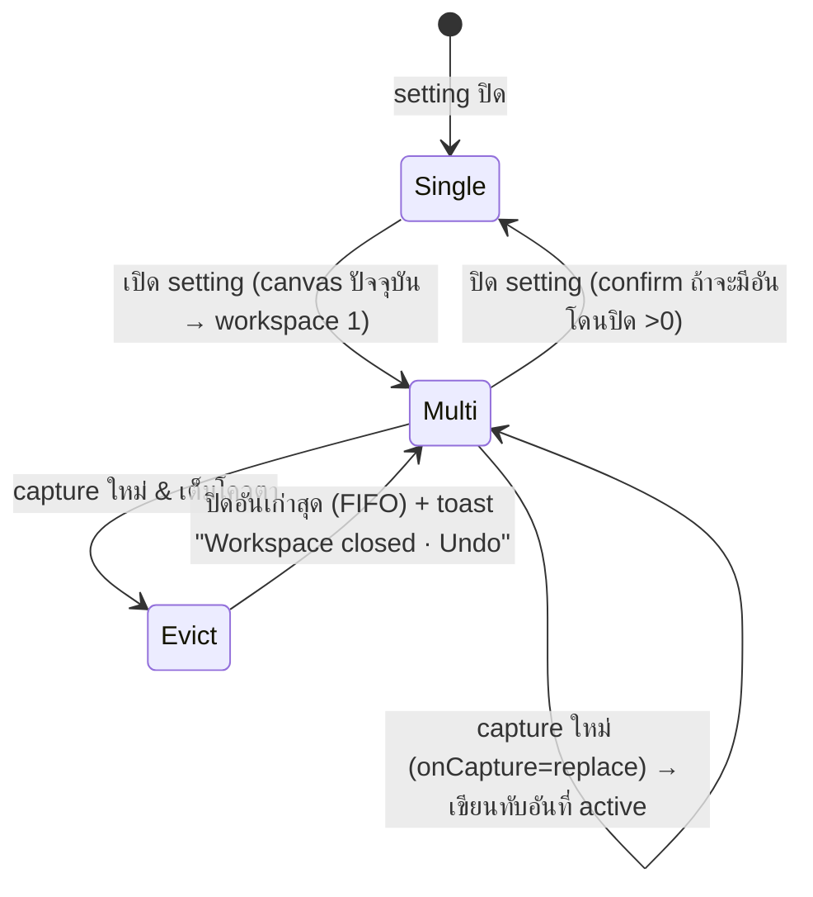

# Multiple Workspaces + Capture History — UX/UI Design

> **Prototype (คลิกได้):** [multi-workspace-prototype.html](multi-workspace-prototype.html)
> เปิดผ่าน preview server เพื่อดูบน Mac — ดู §Part 0
>
> Branch `feat/multi-workspace` · worktree `~/development/capz-multi-workspace`


## Context

วันนี้ capz มี **workspace เดียว**: `EditorPage` ถือ `file`/`src` เป็น local state ตัวเดียว,
`useEditor` เป็น global store ตัวเดียวที่โดน `reset()` ทุกครั้งที่โหลดภาพใหม่, และฝั่ง Rust
`AppState.active_temp_path` เป็น `Mutex<Option<PathBuf>>` ช่องเดียว — `windows::load_editor_image`
**ลบไฟล์ temp เดิมทิ้ง**ตอน swap (`src-tauri/src/windows.rs:589-596`) ผลคือ capture ใหม่ = งานเดิมหายทันที
และไม่มีอะไรรอดข้ามการปิดแอปเลย (มีแค่ `config.json` ที่ persist)

สองฟีเจอร์นี้แก้คนละอาการของปัญหาเดียวกัน — *งานที่ทำไปแล้วหายง่ายเกินไป*:

1. **Multiple workspaces** — เปิดหลาย capture พร้อมกัน สลับไปมาได้ แต่ละอันเก็บ annotation/crop/zoom
   ของตัวเอง และรอดข้าม restart
2. **Capture history** — จำไฟล์ที่ save ลงดิสก์แล้ว เพื่อดึงกลับมาใช้ / reveal / copy / ลบ ได้จาก sidebar

**เอกสารนี้คือ design spec** — ยังไม่ implement โค้ดจริง งานชิ้นแรกคือ **prototype HTML คลิกได้**
ให้ดูของจริงก่อนเคาะ

### ข้อตัดสินใจที่ผู้ใช้เลือกไว้แล้ว
| หัวข้อ | เลือก |
|---|---|
| capture ใหม่เข้ามาตอนเปิด multi-workspace | **ตั้งค่าได้ทั้งสองแบบ** — `new` (สร้าง workspace ใหม่) หรือ `replace` |
| ปุ่ม New workspace | **อยู่ใน Toolbar เสมอ** + มีไทล์ `+` ในบาร์ล่างด้วยตอน ≥2 |
| Delete ใน Capture history | **ย้ายเข้า Trash / Recycle Bin** |
| undo/redo stack | **ไม่ persist ข้าม restart** — อยู่ใน session เท่านั้น |
| Capture history | มี **max cap + FIFO** (§2.5) |
| Capture history | สลับดูได้ทั้ง **list / thumbnail grid** (§2.2) |
| บาร์ล่าง | **ย่อ/ขยายได้ด้วยปุ่ม toggle** (§1.2.1) |
| Web build (`/paste`) | multi-workspace **ทำงาน (in-memory)**, capture history **ปิด** (§5) |

### Worktree

งานทั้งหมดทำใน worktree แยกจาก `origin/main` ล่าสุด (ตาม CLAUDE.md):
```bash
git fetch origin
git worktree add ../capz-multi-workspace -b feat/multi-workspace origin/main
```
รายงาน path ให้ผู้ใช้ก่อนแก้โค้ดบรรทัดแรก

---

## Part 0 — Deliverable แรก: Prototype

ไฟล์เดียว standalone: `docs/design/multi-workspace-prototype.html`
(+ design doc `docs/design/MULTI-WORKSPACE.md` ที่เสิร์ฟผ่าน md-server)

ใช้ Graphite tokens จริงจาก `src/app/globals.css` (copy `:root` + `.light` block เข้าไป)
เสิร์ฟด้วย skill `preview-html` เพื่อเปิดบน Mac ผ่าน Tailscale

**State ที่ toggle ได้ใน prototype** (แถบ control ลอยมุมขวาบน, ไม่ใช่ส่วนของ UI จริง):
- Workspaces: `off` / `1` / `3` / `5 (เต็ม)`
- Bottom bar: `expanded` / `collapsed` (ปุ่ม toggle จริง)
- Sidebar: `no tool selected (Global panel)` / `tool selected` — เพื่อพิสูจน์ว่า history โผล่/หายถูกที่
- Capture history: `off` / `empty` / `12 items` / `เต็มโควตา 50` / `มีไฟล์หาย 1 อัน`
- History view: `list` / `thumbnail grid`
- Shell: `desktop` / `web (/paste)` — เพื่อเทียบว่าอะไรหายไปบนเว็บ
- Viewport: `1440` / `900` / `400 (phone)`
- Theme: dark / light
- Modals: Delete workspace / Delete file / Turn off multi-workspace
- Drag affordance: จำลอง drag row ประวัติลงแคนวาส ทั้งเคส canvas ว่าง และ canvas มีภาพ

ไม่ต้องมี Konva จริง — ใช้ภาพ placeholder + CSS ล้วน จุดประสงค์คือ **ตัดสินใจเรื่อง layout/สัดส่วน/สถานะ**

---

## Part 1 — Multiple Workspaces

### 1.1 โครงหน้าจอ

บาร์ล่างเป็น **sibling ของ `<main>`** (เต็มความกว้างหน้าต่าง วิ่งใต้ sidebar ด้วย) —
root เป็น `flex h-screen flex-col` อยู่แล้ว (`src/app/editor/page.tsx:383`) แค่แทรก `flex-none` ก่อน `<Toaster>` (:429)

เหตุผลที่เลือกเต็มความกว้าง ไม่ใช่เฉพาะคอลัมน์แคนวาส: workspace เป็น **chrome ระดับแอป**
(เหมือน dock / filmstrip) ไม่ใช่ property ของภาพ — และการหั่น 240px ของ sidebar ออก
ทำให้ไทล์ 5 อันเริ่มต้องเลื่อนตั้งแต่หน้าต่างขนาดกลาง

```
┌────────────────────────────────────────────────────────────────────────┐
│  Toolbar   [tools…]                    ⊞ New ws   ⤓ Export   ⚙        │  ← +ปุ่ม New workspace
├──────────────────────────────────────────────┬─────────────────────────┤
│                                              │  VIEW                   │
│                  EditorStage                 │  ZOOM · Rulers          │
│                   (Konva)                    │  WORKSPACE              │
│                                              │  Add image / Clear      │
│                                              │  TEXT · BACKDROP        │
│                                              │  ───────────────        │
│                                              │  HISTORY        12  ⋯   │  ← Part 2
│                                              │  ▤ capz-…1432   14:32   │
│                                              │  ▤ capz-…1408   14:08   │
├──────────────────────────────────────────────┴─────────────────────────┤
│ ┌────┐ ┌────┐ ┌────┐ ┌╌╌╌╌┐                                        ⋯  │  ← WorkspaceBar 84px
│ │ ①  │ │ ②  │ │ ③  │ ╎ +  ╎                                           │
│ └────┘ └────┘ └────┘ └╌╌╌╌┘                                           │
└────────────────────────────────────────────────────────────────────────┘
```

บาร์ **ซ่อนสนิท** (height → 0, transition 140ms `var(--ease)`) เมื่อ `order.length <= 1`
ปุ่ม New ใน Toolbar จึงเป็นทางเดียวที่จะได้ workspace ที่ 2 — และมันอยู่ตลอดเวลาที่ setting เปิด

### 1.2 Anatomy ของไทล์

```
      ┌──────────────────┐  100 × 62  (16:10) radius-md
      │ ①            ✕   │  badge 16px TL / close TR (hover only)
      │                  │  ← thumb: object-fit contain บนพื้น --bg-canvas
      │      [thumb]     │
      │                ● │  ← dot 5px --accent = มี annotation แล้ว
      └──────────────────┘
           Area · 2m         ← 10px --fg-4 (แสดงเฉพาะ active + hover)
```

| สถานะ | สเปก |
|---|---|
| active | `border:1px var(--accent)` + `box-shadow:0 0 0 1px var(--accent)`, opacity 1, `translateY(-2px)`, badge พื้น `--accent`/ตัว `--accent-fg` |
| idle | `border:1px var(--border)`, opacity .62, badge พื้น `--surface-raised`/ตัว `--fg-3` |
| hover (idle) | opacity 1, `border-color:var(--border-strong)`, เผยปุ่ม ✕ + caption |
| focus-visible | `box-shadow: var(--shadow-focus)` |
| drag-reorder | เส้นแทรก 2px `--accent` ระหว่างไทล์, ไทล์ที่ลากทำ opacity .4 |
| loading thumb | skeleton shimmer บน `--surface-raised` |

ไทล์ `+ New`: กรอบ dashed `--border-strong`, ไอคอน `Plus` 16px + label `New` 10px
เต็มโควตา → `disabled` (opacity .4) + tooltip `Maximum 5 workspaces — close one first`

บาร์: `overflow-x-auto`, ซ่อน scrollbar, มี fade mask 24px ซ้าย/ขวาเมื่อ scroll ได้

ชิดขวาสุดเป็นกลุ่มคอนโทรลตายตัว (ไม่ scroll ไปกับไทล์ — `flex-none` + `border-l` คั่น):
`⌄ collapse` · `⋯ menu` (ใช้ `ui/dropdown-menu`: `Close others` · `Close all` · `Workspace settings…`)

### 1.2.1 ย่อ/ขยายบาร์

สองระดับ ไม่ใช่ซ่อนสนิท — **ตอนย่อยังสลับ workspace ได้** ไม่งั้นปุ่มย่อจะเท่ากับปิดฟีเจอร์

```
EXPANDED  84px          COLLAPSED  30px
┌────────────────┐      ┌──────────────────────────────────────┐
│ ┌──┐┌──┐┌──┐┌+┐│      │ ① ② ③  +            3 workspaces  ⌃ ⋯│
│ │①││②││③││ ││      └──────────────────────────────────────┘
│ └──┘└──┘└──┘└─┘│        ↑ pill 22×18 radius-sm, active = พื้น --accent
│         3/5 ⌄ ⋯│          idle = พื้น --surface-raised / ตัว --fg-3
└────────────────┘          hover = --surface-raised-hover
```

- ปุ่ม toggle: `btn-icon` 24×24 ไอคอน `ChevronDown` (ตอนขยาย) / `ChevronUp` (ตอนย่อ)
  `aria-expanded` + `aria-controls="workspace-bar"`, title `Collapse workspace bar` / `Expand workspace bar`
- transition: `height 160ms var(--ease)` + ไทล์ fade `opacity 100ms`; เคารพ `prefers-reduced-motion`
- **double-click ที่พื้นที่ว่างของบาร์** = toggle เหมือนกัน
- จำสถานะไว้ที่ `workspaces.json` เป็น **enum เดียว** `barMode: "hidden" | "rail" | "full"`
  (+ `barModeUserSet: boolean`) — ไม่ใช่ boolean สองตัวที่ขัดกันเองได้ ดู §6.2 D4
  `hidden` ถูกคำนวณจาก `order.length <= 1` เสมอ ไม่ใช่ค่าที่ผู้ใช้ตั้งได้
- ตอนย่อ: hover pill → tooltip โชว์ thumb 100×62 + caption (ให้ยัง preview ได้)
- ตอนย่อแล้วมี capture ใหม่เข้ามา → **ไม่ auto-expand** แต่ pill ใหม่ pulse 1 ครั้ง (`--accent-soft` flash 400ms)

### 1.3 พฤติกรรม



**สลับ workspace** (คลิกไทล์ / `Alt+1…9` / `Ctrl+Tab`):
1. `commitActive()` — ดูดสถานะปัจจุบันจาก `useEditor.getState()` + scroll ของ container + สร้าง thumbnail ใหม่ → เขียนลง `docs[activeId]`
2. `activeId = id`
3. `page.tsx` เซ็ต `file`/`src` จาก `doc.imagePath` แล้วเรียก `useEditor.hydrate(doc)` (**ไม่ใช่ `reset()`**)
4. คืน undo/redo stack จาก in-memory map (ไม่แตะดิสก์)
5. คืน `displayScale` **ก่อน** เปลี่ยน `src` — `EditorStage` auto-fit ก็ต่อเมื่อ `displayScale === 0`
   (`stores/editor.ts:337`) ดังนั้นการ hydrate ค่าที่ไม่ใช่ 0 จะกัน auto-fit ให้เอง
6. คืน `scrollLeft/Top` **หลังภาพ decode เสร็จ** — `EditorStage` วันนี้ไม่มี callback ตอนโหลดเสร็จ
   ต้องเพิ่ม prop `onImageReady?(natural)` ที่ยิงเมื่อ `useImage` status → `"loaded"` (`EditorStage.tsx:262`)
   ระหว่างรอ ห้ามสร้าง thumbnail หรือ export — `getStageImageSize()` (`src/lib/stageBridge.ts`)
   ยังคืนขนาดของภาพ **เก่า** อยู่ เพราะ stage node ไม่ได้ remount
   → workspaces store ต้องมีธง `swapping: boolean` ที่บล็อก thumbnail/export ระหว่างสลับ

**Startup precedence** — มีสองแหล่งที่อ้างว่ารู้ว่า "ภาพปัจจุบันคืออะไร":
`editor_current_image` (temp path ฝั่ง Rust, `page.tsx:142-148`) และ `workspaces.json`
กติกา: ถ้า `workspaces.enabled && order.length > 0` → **`workspaces.json` ชนะ** และไม่ต้องเรียก
`editor_current_image` เลย; นอกนั้นใช้ path เดิม (พฤติกรรมวันนี้ไม่เปลี่ยน)

**ลบ workspace** (✕ บนไทล์ / เมนู ⋯):
- ถ้า `annotations.length === 0 && !imageCrop` → ปิดเลย ไม่ต้องถาม + toast undo 5 วิ
- ถ้ามีงานแก้ไข → **confirm modal** (ดู §1.6) — เฉพาะตอน**ผู้ใช้กดปิดเอง** เท่านั้น
  การปิดอัตโนมัติ (evict/replace) ไม่มี modal ใช้ toast undo แทน (§6.2 D2/D3)
- ปิดอันที่ active → ย้ายไป workspace ทางซ้าย ถ้าไม่มีก็ทางขวา; ปิดอันสุดท้าย → canvas ว่าง + บาร์ซ่อน

**Keyboard** (เช็คแล้วไม่ชนของเดิม — `mod+0`/`mod+1` เป็น zoom fit / 100% อยู่ที่
`src/hooks/useEditorShortcuts.ts:68,73` จึง **ห้ามใช้ `Cmd+1..5`**):

| คีย์ | ทำอะไร |
|---|---|
| `Alt+1…9` | ไป workspace ที่ n |
| `Ctrl+Tab` / `Ctrl+Shift+Tab` | ถัดไป / ก่อนหน้า (วนรอบ) |
| `Cmd/Ctrl+Shift+N` | workspace ใหม่ (ว่าง) |

⚠️ ต้อง **guard ตอนกำลังพิมพ์**: text tool มี inline editor (`EditorStage.tsx:287` state `textEditor`)
ถ้าไม่กัน `Alt+1` จะสลับ workspace ทั้งที่ผู้ใช้กำลังพิมพ์อยู่ (และบน macOS `Alt+1` = `¡`)
เช็ค `document.activeElement` เป็น input/textarea/contenteditable ก่อน — `useEditorShortcuts.ts` มี guard แบบนี้อยู่แล้ว ใช้ซ้ำได้

**A11y ของบาร์**: `role="tablist"` + `aria-label="Workspaces"`, ไทล์เป็น `role="tab"` + `aria-selected`,
คอลัมน์แคนวาสเป็น `role="tabpanel"` + `aria-labelledby` ของไทล์ที่ active
ลูกศร ←/→ เลื่อน focus ในบาร์ (roving tabindex), `Home`/`End` ไปหัว/ท้าย, `Delete` ปิดอันที่ focus
capture ใหม่เข้ามา → ประกาศผ่าน `aria-live="polite"`: `Workspace 4 added`

### 1.4 Data model

สร้าง `src/stores/workspaces.ts` (zustand, ไม่มี persist middleware — เขียนเองเหมือน `settings.ts:30-34`)

```ts
export type WorkspaceDoc = {
  id: string;                 // uid()
  createdAt: number; updatedAt: number;
  imagePath: string;          // ไฟล์ถาวรใน appDataDir/workspaces/<id>.png — ไม่ใช่ capz-temp-*
  captureSource: CaptureSource;
  naturalSize: { w: number; h: number } | null;
  // document (ตรงกับ useEditor)
  annotations: Annotation[]; nextPinNumber: number;
  imageCrop: ImageCrop | null; backdropOn: boolean;
  // view
  displayScale: number; userZoomed: boolean; scroll: { left: number; top: number };
  // ui
  thumb: string;              // data URL jpeg q0.6 กว้าง 160px
};
```

- persist: store file ใหม่ `workspaces.json` key `"docs"` + `"order"` + `"activeId"`
  (แยกจาก `config.json` เพราะเขียนบ่อยและใหญ่ — `settings.ts` เขียนทั้ง config ทุกครั้งที่ update)
  เขียนแบบ debounce 800ms
- **ไม่ persist `past`/`future`** ตามที่ตกลง — เก็บใน module-level `Map<id, {past, future}>` ในหน่วยความจำ

**เพิ่ม action ใน `useEditor`**: `hydrate(doc)` — เซ็ตทุกฟิลด์พร้อมกัน (คู่ขนานกับ `reset()` ที่ `src/stores/editor.ts:488`)

> ⛔ **Blocker ที่เจอตอน scrutinize รอบ 1 — ต้องแก้ก่อนอย่างอื่น**
> `assetProtocol.scope` ใน `src-tauri/tauri.conf.json:17-24` อนุญาตแค่
> `$TEMP/**`, `**/capz-temp-*.png`, `**/capz-temp-*.jpg`
> → `convertFileSrc()` ของไฟล์ใน `$APPDATA/workspaces/` จะ **ถูกบล็อก ภาพไม่ขึ้นเลย**
> และ `fs:scope` ใน `src-tauri/capabilities/editor.json` ก็ไม่มี `$APPDATA` เหมือนกัน
> **ต้องเพิ่มทั้งสองที่**: `assetProtocol.scope += "$APPDATA/workspaces/**"` และ
> `fs:scope.allow += { "path": "$APPDATA/workspaces/**" }`

**ฝั่ง Rust** (`src-tauri/src/commands/editor.rs` + `services/image_service.rs`):
- `persist_workspace_image(temp_path) -> String` — copy temp → `app_data_dir/workspaces/<uid>.png` คืน path ใหม่
  แก้ปัญหาหลักที่ `load_editor_image` ลบ temp ตัวก่อนทิ้ง และ `sweep_stale_temp` ล้าง 24 ชม.
- `delete_workspace_image(path)` — **หน่วงไว้ 6 วิ**ระหว่างหน้าต่าง undo ของ toast
  (ลบทันทีตอน evict = ปุ่ม Undo กดแล้วไม่มีอะไรให้กู้)
- `sweep_orphan_workspace_images(keep_ids: Vec<String>)` — ⚠️ **frontend เป็นคนเรียก หลัง hydrate สำเร็จเท่านั้น**
  ห้ามให้ Rust เรียกเองตอน startup: ถ้า `workspaces.json` อ่านไม่ออก/ยังไม่โหลด keep list จะว่าง
  แล้วมันจะลบภาพของ **ทุก workspace** ทิ้ง — data loss ถาวร
  ถ้า hydrate ล้มเหลว → ข้าม sweep ไปเลย ปล่อยไฟล์กำพร้าไว้ดีกว่าลบของจริง
- `AppState.active_temp_path` **คงไว้ตามเดิม** (มันคือ "ไฟล์ที่ editor กำลังถืออยู่") แต่ workspace
  ไม่พึ่งมันแล้ว เพราะย้ายไปไฟล์ถาวรตั้งแต่ตอนสร้าง

### 1.5 Thumbnail (live)

- แหล่ง: `getStage()` จาก `src/lib/stageBridge.ts` → `toDataURL({...exportBox, pixelRatio: 160/boxW, mimeType:"image/jpeg", quality:0.6})`
- trigger: subscribe `useEditor` (`annotations`, `imageCrop`, `backdropOn`) **debounce 500ms** + ตอน `commitActive()` + ตอน window blur
- ไทล์ที่ไม่ active ใช้ thumb ที่แช่ไว้ (มันเปลี่ยนไม่ได้อยู่แล้ว) → ต้นทุนคงที่ ไม่โตตาม N

### 1.6 Confirm modal

ยังไม่มี dialog primitive ในโปรเจกต์ (`src/components/ui/` มีแค่ button, dropdown-menu, input, label, select, switch, tabs)

**เขียน `ConfirmDialog` ขึ้นใหม่ ~60 บรรทัด อย่าไป refactor `InertGrantRecoveryDialog`** —
ตัวนั้นเป็น wizard 4 ขั้นที่ poll permission อยู่ (`InertGrantRecoveryDialog.tsx:40-60`)
การดึง confirm ออกมาจากมันจะแตะโค้ด permission recovery ที่ทดสอบยาก โดยไม่ได้อะไรกลับมา
ยืม pattern (overlay + Esc handler + focus) มาก็พอ ใช้ร่วมทั้ง 3 จุด (ปิด workspace / ลบไฟล์ / ปิด setting)

```
        ┌──────────────────────────────────────────┐
        │  ⚠  Close workspace 3?                   │   --text-lg semibold
        │  ┌──────┐                                │
        │  │thumb │  7 annotations · cropped       │   88×55 thumb + --fg-3 --text-sm
        │  └──────┘  Captured 12 minutes ago       │
        │                                          │
        │  The edits in this workspace will be     │   --fg-2 --text-base
        │  discarded. The screenshot file is not   │
        │  saved anywhere else.                    │
        │                                          │
        │                   [ Cancel ]  [ Close ]  │   ghost + danger
        └──────────────────────────────────────────┘
```
- overlay `rgba(0,0,0,.55)`, การ์ด `.surface` + `--elev-3` + `--radius-xl`, กว้าง 400px
- Esc = Cancel, Enter = ปุ่มขวา, focus trap, autofocus ที่ **Cancel** (ปุ่มทำลาย)

**ตอนปิด setting** ขณะมี >1 workspace:
`Turn off multiple workspaces? 4 workspaces will be closed and their edits discarded. Workspace 2 (the one you're editing) is kept.`

### 1.7 Settings

`src/components/settings/SettingsView.tsx` แท็บ **General** — `SectionCard` ใหม่ใช้ `ToggleRow` (:686) กับ `FieldRow` (:569) ที่มีอยู่

```
┌─ Workspaces ───────────────────────────────────────────┐
│ Multiple workspaces                            [  ●]   │
│ Keep several captures open at once and switch between  │
│ them. Each keeps its own annotations.                  │
│ ─────────────────────────────────────────────────────  │
│ Maximum workspaces                          [ 5   ▾ ]  │  2–9
│ When a new capture arrives      [ Open in a new ws ▾ ]  │  new | replace
│ When all 5 are used, the oldest is closed. You can      │  hint --fg-4 --text-sm
│ undo, or switch to "Replace the current workspace".     │  ← ผูก D2 กับทางออกให้ชัด
└────────────────────────────────────────────────────────┘
```
สองแถวล่าง disabled (opacity .45) ตอน toggle ปิด — ไม่ซ่อน เพื่อให้เห็นว่ามีอะไรให้ปรับ

**Config** — เพิ่ม section ใหม่ระดับบนสุดใน `AppConfig` (`src/lib/config.ts:41`):
```ts
workspaces: { enabled: boolean; max: number; onCapture: "new" | "replace" };  // false, 5, "new"
history:    { enabled: boolean; max: number; viewMode: "list" | "grid" };      // false, 50, "list"
```
⚠️ ต้องแก้ **สามที่** ไม่งั้น `validateConfig` จะทิ้ง key แล้ว self-heal ลบออกจากดิสก์:
`AppConfig` type (:41) → `DEFAULT_CONFIG` (:292) → validator map (:536 กลุ่ม `vGeneral`)

---

## Part 2 — Capture History

### 2.1 ที่อยู่

`GlobalToolsPanel` (`src/components/editor/toolbar/panels/GlobalToolsPanel.tsx`) — ต่อท้าย section ที่มีอยู่
(View / Workspace / Text / Backdrop) ตรงกับที่ขอไว้ว่า "after existing options, when no tool selecting"

panel นี้เป็น presentational ล้วน แต่ history ต้องอ่าน store เอง → ทำเป็น
`<CaptureHistorySection />` ที่อ่าน store ของตัวเอง ตามแบบ `BackdropSection` (`BackdropControl.tsx:18`) ซึ่งทำแบบนี้อยู่แล้ว

แสดงเมื่อ `tauriUi && config.history.enabled` เท่านั้น (web build ปิดตาย)

### 2.2 Anatomy (กว้างใช้งานได้ ~232px)

**List view** (ค่าเริ่มต้น):

```
  HISTORY              12   [▤|▦]   ⋯      ← count + segmented view-switch + kebab
  ┌──────────────────────────────────────┐
  │ Today                                │  ← group header 10px --fg-4 (เมื่อ >8 รายการ)
  ├──────────────────────────────────────┤
  │ ▤  capz-20260911-143205.png          │  ← 40×26 thumb + 11px --fg-2 truncate หัวท้าย
  │    14:32 · 1.2 MB · 2560×1440        │  ← 10px --fg-4
  ├──────────────────────────────────────┤
  │ ▤  capz-20260911-140812.png      ◂SEL│  ← selected: bg --accent-soft, แถบซ้าย 2px --accent
  │    14:08 · 840 KB                    │
  │  ┌────────────────────────────────┐  │
  │  │  ⤢ Reveal   ⧉ Copy      🗑     │  │  ← action strip เลื่อนลงมา 28px, 🗑 hover → --danger
  │  └────────────────────────────────┘  │
  ├──────────────────────────────────────┤
  │ ▤̶  capz-20260910-2201.png       ⚠   │  ← ไฟล์หาย: thumb opacity .35, ชื่อ line-through
  │    Yesterday · File not found        │     action เหลือ "Remove from list"
  └──────────────────────────────────────┘
```

- แถวสูง 40px, radius-sm, hover → `--surface-raised`
- รายการ scroll เองด้วย `max-h-[280px] overflow-y-auto` (ไม่ต้องรื้อ layout ของ `<aside>` ที่ scroll ทั้งก้อนอยู่แล้ว)
- empty: `No saved files yet` + บรรทัดรอง `Files you export land here.` (11px `--fg-4`, จัดกลาง, padding 20px)
- kebab `⋯` (ใช้ `ui/dropdown-menu`): `Open save folder` · `Clear history`
- คลิกขวาที่แถว = เมนูเดียวกับ action strip (Reveal / Copy / Delete)

**ทำไมเลือก action strip แบบ inline แทน kebab ต่อแถว**: กว้าง 232px ทำให้ kebab เบียดชื่อไฟล์
และ inline strip ค้นเจอง่ายกว่า (ไม่ต้องเดาว่ามีเมนูซ่อน) — คลิกแถวอีกครั้งเพื่อยุบ

**Thumbnail grid view:**

```
  HISTORY              12   [▤|▦]   ⋯
  ┌──────────────────────────────────────┐
  │  ┌───────────┐  ┌───────────┐        │  ← 2 คอลัมน์ · ไทล์ 108×68 · gap 8
  │  │           │  │           │        │     (232 − 8 gap) / 2 = 112 → ใช้ 108 + padding
  │  │  [thumb]  │  │  [thumb]  │        │
  │  │     14:32 │  │     14:08 │        │  ← time badge 9px ขวาล่าง บน scrim
  │  └───────────┘  └───────────┘        │
  │  ┌───────────┐  ┌───────────┐        │
  │  │ ⤢  ⧉   🗑 │  │           │        │  ← ไทล์ที่ selected: scrim ล่าง + 3 ปุ่ม 24px
  │  └───────────┘  └───────────┘        │
  └──────────────────────────────────────┘
```
- ไม่แสดงชื่อไฟล์ในกริด — `title` attribute + tooltip ตอน hover แทน
- ไฟล์หาย: ไทล์ทึบ opacity .35 + `AlertTriangle` มุมขวาบน + scrim เหลือปุ่มเดียว `Remove`
- ไม่มี day-group header ในโหมดกริด (จะทำให้กริดขาดเป็นท่อน) — เรียงใหม่→เก่าเฉยๆ
- `max-h-[280px] overflow-y-auto` เท่ากับโหมด list

**สลับโหมด**: `IconSegmented` ที่มีอยู่แล้ว (`panels/kit.tsx:61`) ไอคอน `List` / `LayoutGrid`
จำไว้ที่ `config.history.viewMode` (เป็น preference จริง → อยู่ใน `config.json` ถูกแล้ว)

### 2.3 Drag เข้าแคนวาส

```mermaid
flowchart LR
    A[กดค้างที่แถว] --> B{ลากเกิน 4px?}
    B -- ไม่ --> C[= คลิก → select]
    B -- ใช่ --> D[ghost thumb ตามเมาส์<br/>+ drop overlay บนแคนวาส]
    D --> E{canvas ว่าง?}
    E -- ว่าง --> F["Drop to open as the main image"<br/>importImagePathDesktop path]
    E -- มีภาพ --> G["Drop to add as a layer"<br/>read_image_file_data_url → addOverlayImage"]
```

Drop overlay: ทับคอลัมน์แคนวาสทั้งผืน — พื้น `--accent-soft`, กรอบ dashed 2px `--accent` เว้นขอบ 12px,
กลางจอเป็น pill `.surface` + `--elev-2` ที่มีไอคอน + ข้อความข้างบน

⚠️ **ห้ามใช้ HTML5 drag-and-drop**: หน้าต่าง editor เปิด `drag_drop_enabled` ของ Tauri
(`page.tsx:343-370` ใช้ `onDragDropEvent`) ซึ่งบน Windows/WRY จะกลืน HTML5 dragstart ในเพจไป
→ ใช้ **pointer-based drag** (`pointerdown` + `setPointerCapture` + ghost `div` ที่ `position:fixed`)
เหมือน `src/lib/touchGestures.ts` ทำกับ canvas อยู่แล้ว

ทางลัดเพิ่มเติม: **double-click แถว = drop ตรงกลางแคนวาส** (สำหรับคนที่ไม่ลาก)
ไฟล์หาย → สั่น 200ms + toast `File no longer exists` + mark `missing`

### 2.4 Actions

| | ทำอะไร | ใช้ของที่มีอยู่ |
|---|---|---|
| **Reveal** | เปิด Finder/Explorer โฟกัสไฟล์ | `invoke("reveal_in_finder", { path })` — **มีอยู่แล้ว** `src-tauri/src/commands/output.rs:16` |
| **Copy** | อ่านไฟล์ → clipboard เป็น PNG | `read_image_file_data_url` (consumeTemp: false) → `writeImage` ทาง `plugin-clipboard-manager` (เหมือน `exportImage.ts:75-102`) |
| **Delete** | confirm → **ย้ายเข้า Trash** → ลบ entry | Rust command ใหม่ `trash_file(path)` ด้วย crate `trash` (`cargo add trash`) |

Modal ลบไฟล์ (ใช้ `ConfirmDialog` ตัวเดียวกับ §1.6):
```
⚠  Move to Trash?
    capz-20260911-140812.png
    ~/Pictures/capz · 840 KB
    You can restore it from the Trash. It will also be removed from this list.
                                   [ Cancel ]  [ Move to Trash ]
```

### 2.5 Data + hook point

`src/stores/history.ts` → persist store file `history.json` key `"items"`
```ts
export type HistoryItem = {
  id: string; path: string; fileName: string; savedAt: number;
  size: { w: number; h: number }; bytes: number;
  thumb: string;          // data URL jpeg q0.6 กว้าง 128px (พอสำหรับไทล์กริด 108px)
  missing?: boolean;      // resolve ตอน mount ด้วย plugin-fs exists()
};
```

**Cap + FIFO** (`config.history.max`, ค่าเริ่มต้น 50, เลือกได้ 20/50/100/200):
```ts
record(item) {
  // 1. dedupe: save ทับ path เดิม → แทนที่ entry เดิม ไม่สร้างซ้ำ
  const rest = items.filter(i => i.path !== item.path);
  // 2. ใหม่สุดอยู่บน
  const next = [item, ...rest];
  // 3. FIFO trim — ตัดตัวเก่าสุดท้ายแถวออก (ไฟล์บนดิสก์ไม่ถูกแตะ ตัดแค่ระเบียน)
  return next.slice(0, max);
}
```
- ลด `max` ใน Settings → trim ทันที พร้อม toast `Removed 30 older entries from the list (files untouched)`
- **ตัดออกเพราะเต็ม ≠ ลบไฟล์** ต้องเขียนชัดใน hint ของ Settings ไม่งั้นคนเข้าใจผิดว่าไฟล์หาย
- ขนาดที่ persist: 200 รายการ × thumb 128px jpeg q0.6 (~4–6KB) ≈ 1MB ยังโอเคสำหรับ store file

**จุด hook เดียว**: `saveToFile()` ใน `src/lib/exportImage.ts:133-171` — หลัง `writeFile(path, bytes)` (:169)
ตรงนั้นมีครบทั้ง `path`, `bytes`, และ `stage` (สร้าง thumb ได้เลย) และ web build return ออกไปก่อนแล้วที่ :141
ครอบด้วย `if (isTauriRuntime() && config.history.enabled)`

ครอบคลุมทุกทางที่ไฟล์ลงดิสก์โดยอัตโนมัติ: ปุ่ม Export, `Cmd+C` shortcut (`page.tsx:276`),
และ close-action (`src/lib/preClose.ts`)

### 2.6 Settings

```
┌─ Capture history ──────────────────────────────────────┐
│ Remember saved files                           [  ●]   │
│ Keep a list of the screenshots you export, with a      │
│ thumbnail, so you can find or reuse them later.        │
│ ─────────────────────────────────────────────────────  │
│ Keep the last                             [ 50    ▾ ]  │  20 | 50 | 100 | 200
│ Older entries drop off the list. The files stay on     │  hint --fg-4 --text-sm
│ your disk.                                             │
│ Show as                                    [ ▤  | ▦ ]  │  List | Thumbnails
│                                        [ Clear list ]  │  btn--ghost, ตัวหนังสือ --danger
└────────────────────────────────────────────────────────┘
```

---

## Part 3 — ไฟล์ที่จะแตะ

| ไฟล์ | ทำอะไร |
|---|---|
| `docs/design/multi-workspace-prototype.html` | **ใหม่** — prototype |
| `docs/design/MULTI-WORKSPACE.md` | **ใหม่** — design doc |
| `src/stores/workspaces.ts` | **ใหม่** — docs/order/activeId + persist + switch/create/close |
| `src/stores/history.ts` | **ใหม่** — items + persist + record/remove/clear |
| `src/components/editor/WorkspaceBar.tsx` | **ใหม่** — บาร์ล่าง + ไทล์ + reorder |
| `src/components/editor/panels/CaptureHistorySection.tsx` | **ใหม่** — section + rows + action strip + pointer-drag |
| `src/components/ui/ConfirmDialog.tsx` | **ใหม่** — แยกออกจาก `InertGrantRecoveryDialog` |
| `src/stores/editor.ts` | เพิ่ม `hydrate(doc)` คู่กับ `reset()` (:488) |
| `src/app/editor/page.tsx` | แทรก `<WorkspaceBar/>` ก่อน `<Toaster>` (:429); `applyFile` แตกเป็น `applyWorkspace`; routing capture ตาม `workspaces.onCapture` (:124) |
| `src/app/paste/page.tsx` | แทรก `<WorkspaceBar/>` (โหมด in-memory), revokeObjectURL ตอนปิด ws, `beforeunload` guard (§5) |
| `src/components/editor/Toolbar.tsx` | ปุ่ม New workspace + ส่งเข้า `useOverflowSlots` |
| `src/components/editor/toolbar/panels/GlobalToolsPanel.tsx` | ต่อ `<CaptureHistorySection/>` ท้าย panel |
| `src/lib/exportImage.ts` | hook history ที่ `saveToFile` (:169) |
| `src/lib/config.ts` | 2 section ใหม่ × 3 จุด (type :41 / DEFAULT :292 / validator :536) |
| `src/components/settings/SettingsView.tsx` | 2 SectionCard ใน General tab (:335-554) |
| `src/hooks/useEditorShortcuts.ts` | `Alt+1..9`, `Ctrl+Tab`, `Cmd/Ctrl+Shift+N` |
| `src-tauri/src/commands/editor.rs` | `persist_workspace_image`, `delete_workspace_image` |
| `src-tauri/src/commands/output.rs` | `trash_file` (crate `trash`) |
| `src-tauri/src/services/image_service.rs` | `sweep_orphan_workspace_images` |
| `src-tauri/capabilities/editor.json` | `fs:scope.allow += $APPDATA/workspaces/**` |
| `src-tauri/tauri.conf.json` | **`assetProtocol.scope += "$APPDATA/workspaces/**"`** (:17-24) — ไม่แก้ = ภาพไม่ขึ้นเลย |

**ของเดิมที่ reuse ได้เลย ไม่ต้องเขียนใหม่**: `reveal_in_finder`, `read_image_file_data_url`,
`addOverlayImage` (`src/lib/addImage.ts:26`), `importImagePathDesktop` (`src/lib/importImage.ts:19`),
`getStage`/`getStageExportBox` (`src/lib/stageBridge.ts`), `ActionRow`/`Section` (`panels/kit.tsx:156`),
`ToggleRow`/`FieldRow`/`SectionCard` (`SettingsView.tsx:686/569/561`), `ui/dropdown-menu`

---

## Part 4 — ความเสี่ยง / เคสขอบ ที่ต้องตัดสินตอน implement

1. **`ImageAnnotation.src` เป็น data URL** (`editor.ts:223`) → `workspaces.json` อาจโตหลาย MB
   ถ้ามี layer ภาพหลายอัน v1 รับได้ (เขียน debounce + ไม่เก็บ undo stack แล้ว)
   v2 ค่อยแยก layer bitmap ไปเป็นไฟล์ `workspaces/<id>/layers/*.png`
2. **`stageBridge` เป็น module singleton** — ใช้ได้เพราะ mount stage เดียวต่อครั้ง แต่ต้อง re-publish ตอน swap
3. **OCR รอดฟรี** — `useOcr.resultByKey` key ด้วย path อยู่แล้ว (`stores/ocr.ts`)
   ตอนสลับ workspace ให้เรียกแค่ `setKey(newPath)` **ห้ามเรียก `reset()`**
4. **พื้นที่ดิสก์** — 5 workspace × PNG เต็มความละเอียด อาจ 50–100MB → ต้องมี sweep orphan ตอน startup
5. **quit ขณะมีงานยังไม่ save** — v1 ไม่ต้องถาม เพราะ workspace persist อยู่แล้ว
   แต่ `preClose.ts` export เฉพาะอันที่ active เท่านั้น — ต้องเขียนไว้ใน release note
---

## Part 5 — Web build (`/paste`)

`src/app/paste/page.tsx` ใช้ shell เดียวกัน (`Toolbar` + `<main>` + `#tool-options-slot`) แต่ต่างสามเรื่องที่สำคัญ:
ภาพเป็น **Blob object URL** ไม่มี path (`applyBlob` :60-70), **ไม่มี tauri-plugin-store** เลย
(`settings.ts:60-63` ตกกลับไป `DEFAULT_CONFIG` ในหน่วยความจำ), และ sidebar **เลื่อนทับแคนวาส** ต่ำกว่า `sm`
(`page.tsx:290-296`)

### 5.1 Multiple workspaces — **เปิด** (in-memory)

ใช้ได้จริงและมีประโยชน์ (คนวางภาพหลายรูปติดกันบน /paste อยู่แล้ว) — แต่ต้องซื่อสัตย์ว่ามันไม่รอด reload

| | Desktop | Web |
|---|---|---|
| แหล่งภาพ | ไฟล์ถาวร `appDataDir/workspaces/<id>.png` | `Blob` + object URL ในหน่วยความจำ |
| persist ข้าม restart | ✅ `workspaces.json` | ❌ ไม่มี store — **ห้ามใช้ localStorage** (กฎ CLAUDE.md) |
| เปิดใช้ | setting (default off) | **on เสมอ** เมื่อมี ≥2 workspace (ไม่มีหน้า Settings บนเว็บ) |
| onCapture | `new` / `replace` ตามค่า config | `new` เสมอ (ตรงกับ paste/drop ที่มีอยู่) |
| max | 2–9 (default 5) | **3** — จำกัดต่ำกว่าเพราะ blob ทั้งหมดค้างใน RAM ของ tab |

- ต้องเรียก `URL.revokeObjectURL` ตอนปิด workspace ไม่งั้น blob รั่วจนกว่าจะปิด tab
- `beforeunload` guard: ถ้ามี >1 workspace หรือมี annotation → เตือนก่อนออกจากหน้า
  (เป็นครั้งแรกที่ /paste ต้องมี guard — วันนี้ปิด tab แล้วงานหายเงียบๆ อยู่แล้ว จึงถือเป็นการปรับปรุงด้วย)
- **ต้องบอกผู้ใช้ตรงๆ** — เมื่อบาร์โผล่ครั้งแรกบนเว็บ ให้ toast ครั้งเดียว
  `Workspaces are kept in this tab only — they're gone if you reload.`

### 5.2 Capture history — **ปิดบนเว็บ**

ไม่ใช่เพราะขี้เกียจ แต่เพราะทั้งฟีเจอร์ตั้งอยู่บนสิ่งที่เบราว์เซอร์ไม่มี:
`saveToFile` บนเว็บแตกไปเป็น `downloadPng` (`exportImage.ts:141-153`) ซึ่ง **คืนแค่ชื่อไฟล์ ไม่มี path**,
เบราว์เซอร์อ่านโฟลเดอร์ Downloads ไม่ได้, Reveal / Move to Trash ทำไม่ได้, และไม่มีที่ persist รายการ
→ `CaptureHistorySection` ไม่ render เมื่อ `!isTauriRuntime()` และ hook ใน `saveToFile` อยู่หลัง early-return ของเว็บอยู่แล้ว

### 5.3 Layout บนเว็บ / จอแคบ

- บาร์ล่างเป็น sibling ของ `<main>` เหมือนกัน → ไม่ชนกับ sidebar ที่ลอยทับ
- `< sm` (phone): ไทล์ย่อเป็น 72×46, caption หาย, บาร์สูง 62px และ **เริ่มต้นในสถานะ collapsed**
  เพราะจอสูงมีค่ามาก — pill rail 30px ยังสลับ workspace ได้ครบ
- ปุ่ม `+` ยังอยู่ในบาร์; Toolbar บนเว็บแคบมาก ปุ่ม New workspace จะตกไปอยู่ใน `OverflowMenu` ผ่าน `useOverflowSlots`
- ระวังชนกับ touch gesture ที่เพิ่งลงไป (PR #77 pinch-zoom / two-finger pan) — บาร์ต้อง `touch-action: pan-x`
  และไม่กิน gesture ของแคนวาส

---

## Part 6 — ผล Scrutinize 3 รอบ

### รอบ 1 — สถาปัตยกรรม / ความถูกต้อง

| # | ระดับ | สิ่งที่เจอ | แก้แล้ว |
|---|---|---|---|
| 1 | **blocker** | `assetProtocol.scope` (`tauri.conf.json:17-24`) ไม่ครอบ `$APPDATA` → ภาพ workspace ไม่ขึ้น | ✅ §1.4 |
| 2 | **blocker** | `sweep_orphan_workspace_images` ถ้าให้ Rust เรียกเองตอน startup จะลบภาพทุก workspace | ✅ §1.4 |
| 3 | major | `stageBridge` เป็น singleton และ stage **ไม่ remount** ตอนเปลี่ยน `src` → `getStageImageSize()` คืนขนาดภาพเก่าระหว่างสลับ | ✅ ธง `swapping` §1.3 |
| 4 | major | ลบไฟล์ภาพทันทีตอน evict → ปุ่ม Undo ในtoast กดแล้วกู้ไม่ได้ | ✅ หน่วง 6 วิ §1.4 |
| 5 | major | startup มีสองแหล่งความจริง (`editor_current_image` vs `workspaces.json`) | ✅ กติกา precedence §1.3 |
| 6 | minor | ไม่มี hook ตอนภาพ decode เสร็จ → คืน scroll ไม่ได้ | ✅ prop `onImageReady` §1.3 |
| 7 | minor | `fs:allow-read-file` ไม่มีใน `editor.json` — แต่ Copy ใช้ Rust command `read_image_file_data_url` จึงไม่ต้องเพิ่ม | ไม่ต้องแก้ |
| 8 | note | ลบไฟล์ใน history ไม่กระทบ workspace เพราะ workspace ถือ **สำเนา** ใน `$APPDATA` ไม่ใช่ไฟล์ที่ export | ไม่ต้องแก้ |

### รอบ 2 — ความเรียบง่าย (ตัดอะไรได้บ้าง)

- **ทางเลือกที่พิจารณาแล้วไม่เอา**: ไม่ copy ไฟล์ไป `$APPDATA` แต่ให้ `load_editor_image` เลิกลบ temp
  ตัวเก่า แล้วให้ `sweep_stale_temp` ข้ามไฟล์ที่ workspace อ้างถึง — ตัด Rust command ออกได้ 2 ตัว
  และไม่ต้องแก้ capability เลย **แต่พัง**: macOS ล้าง `/var/folders` ตอน reboot → คำสัญญา
  "เปิดแอปใหม่แล้วงานยังอยู่" ไม่จริง สำเนาถาวรจึงจำเป็น (แต่มันไป**แทนที่** logic ลบ temp ไม่ใช่เพิ่มซ้อน)
- **ตัดออก**: refactor `InertGrantRecoveryDialog` → เขียน `ConfirmDialog` ใหม่แทน (§1.6)
- **ยุบ**: grid view กับ list view ใช้ `<HistoryItemActions>` ตัวเดียวกัน อย่าเขียน action strip สองชุด
- **ยุบ**: `hidden (1 ws)` / `collapsed` / `expanded` คือ state เดียวกัน 3 ระดับ — เก็บใน enum เดียว
  `barMode: "hidden" | "rail" | "full"` ไม่ใช่ boolean สองตัวที่ขัดกันเองได้
- **คงไว้**: 2 store แยกกัน (workspaces เขียนบ่อย/ใหญ่, history เขียนนานๆ ครั้ง) และ crate `trash`
  (ไม่มี Tauri plugin ที่ทำให้ และผู้ใช้เลือกพฤติกรรมนี้เอง)

### รอบ 3 — UX / edge case

| # | ระดับ | สิ่งที่เจอ | แก้แล้ว |
|---|---|---|---|
| 9 | major | `<Toaster visibleToasts={1}>` (`page.tsx:429`) → toast undo ของ evict โดน toast ถัดไปเบียดหายทันที | ✅ ดู §6.1 |
| 10 | major | `Alt+1..9` ทำงานทับตอนผู้ใช้กำลังพิมพ์ใน text tool | ✅ guard §1.3 |
| 11 | minor | บาร์ไม่มี ARIA — screen reader ไม่รู้ว่ามันคือ tab | ✅ §1.3 |
| 12 | minor | ตัวนับไม่ตรงกัน (`3/5` ตอนขยาย vs `3 workspaces` ตอนย่อ) | ✅ ใช้ `3/5` ทั้งสองโหมด |
| 13 | ✅ D4 | หน้าต่าง editor ตั้งขนาดเองได้ (`config.general.editorWindow`) — จอเตี้ยๆ บาร์ 84px กินที่มาก | §6.2 |
| 14 | ✅ D1 | ปุ่ม **Clear workspace** เดิม (`GlobalToolsPanel.tsx:71`) แปลว่าอะไรตอนมีหลาย workspace | §6.2 |
| 15 | ✅ D2 | evict อัตโนมัติทับ workspace ที่ผู้ใช้แก้ไขไว้แล้ว | §6.2 |
| 16 | ✅ D3 | `onCapture:"replace"` ทับงานที่แก้ไว้แบบเงียบๆ | §6.2 |

### 6.2 ข้อตัดสินที่ผู้ใช้เคาะแล้ว

**D1 — "Clear workspace" = ล้างเฉพาะ workspace ปัจจุบันให้ว่าง**
ความหมายเดิมไม่เปลี่ยน: ภาพ + annotation หาย แต่ไทล์ยังอยู่ในบาร์เป็น workspace ว่าง พร้อมรับ capture ใหม่
การ**ปิด** workspace ทำได้ทางเดียวคือ ✕ บนไทล์ / เมนู `⋯` / `Delete` ตอน focus อยู่ที่ไทล์
→ ต้องล้าง `imagePath` แล้วสั่ง `delete_workspace_image` ด้วย (ไม่งั้นไฟล์ค้างเป็น orphan)
→ ไทล์ว่างแสดง placeholder: กรอบ dashed + ไอคอน `ImageOff` 14px + label `Empty`

**D2 — evict แบบ FIFO ตรงๆ ไม่สนใจว่าอันเก่าสุดมีงานหรือไม่**
ตัดอันซ้ายสุด (เก่าสุด) เสมอ + toast undo 6 วิ + `Reopen last closed workspace` ในเมนู `⋯` (§6.1)
เหตุผลที่รับได้: ผู้ใช้ที่ไม่อยากให้อะไรหายอัตโนมัติ **มีทางออกอยู่แล้ว** — ตั้ง
`onCapture: "replace"` แล้ว capture จะไม่สร้าง workspace ใหม่เลย จำนวนคงที่ ไม่มีการ evict
ต้องเขียนความสัมพันธ์นี้ให้ชัดใน hint ของ Settings:
`Open in a new workspace — when all 5 are used, the oldest is closed (you can undo).`

**D3 — replace ทับเงียบๆ + toast undo** (ไม่มี modal)
เหมือน D2: `toast("Workspace 2 replaced", { action: Undo, duration: 6000 })`
snapshot ของ workspace ที่โดนทับเก็บไว้ในหน่วยความจำ 6 วิ พร้อมไฟล์ภาพที่ยังไม่ถูกลบ (หน่วง §1.4)

**D4 — auto-collapse ครั้งแรกบนหน้าต่างเตี้ย ไม่ทับค่าที่ผู้ใช้ตั้ง**
```ts
// เก็บใน workspaces.json
barMode: "hidden" | "rail" | "full";
barModeUserSet: boolean;   // true ทันทีที่ผู้ใช้กด toggle เอง
```
ตอน mount: ถ้า `!barModeUserSet && window.innerHeight < 600` → `barMode = "rail"`
หลังจากผู้ใช้กด toggle เอง (`barModeUserSet = true`) จะไม่ auto อีกเลย ไม่ว่าหน้าต่างจะเป็นยังไง
ใช้กติกาเดียวกันบนเว็บ (`< sm` → เริ่มที่ `rail`, §5.3)

**6.1 แก้เรื่อง toast**: อย่าไปยุ่งกับ `visibleToasts={1}` (มันตั้งใจให้เงียบ)
ให้ toast ที่มี Undo ใช้ `toast(..., { id: "workspace-undo", duration: 6000, important: true })`
และ **ปุ่ม Undo สำรอง** อยู่ในเมนู `⋯` ของบาร์ (`Reopen last closed workspace`) เก็บ 1 อันล่าสุดไว้เสมอ
— toast หายไม่ใช่จุดจบ

**Verdict รวม: fix-then-ship** — เหตุผลใหญ่สุดคือ blocker #1 (asset scope) ซึ่งถ้าไม่รู้ก่อน
จะไปเจอตอน dev แล้วภาพขึ้นเป็นกรอบว่างโดยไม่มี error ให้เห็น

---

## Part 7 — สิ่งที่เห็นจริงจาก prototype (รอบ 4, จากการเรนเดอร์)

1. **History ตกใต้ขอบล่างเกือบตลอด** — บนหน้าต่างสูง 720px ที่มีครบทั้ง View / Workspace /
   Text / Backdrop แล้ว section History เริ่มต้นต่ำกว่าขอบ `<aside>` พอดี ผู้ใช้ต้องเลื่อนลงถึงจะเห็น
   และวันนี้ `<aside>` ไม่มี scroll hint อะไรเลย
   **ทางแก้ที่เสนอ** (ไม่ขัดกับ "after existing options" ที่ขอไว้): ทำ header ของ History เป็น
   `position: sticky; top: 0` บนพื้น `--surface-overlay` — แถบ `HISTORY 12 [▤|▦] ⋯` จะลอยค้าง
   ให้เห็นเสมอเมื่อเลื่อน และเพิ่ม fade mask 16px ที่ขอบล่างของ `<aside>` เมื่อยัง scroll ได้
   ทางเลือกสำรอง: ยุบ Backdrop เป็น section ที่พับได้ (มันยาวที่สุด) — แต่นั่นแตะของเดิม
2. **บาร์โหมด rail อ่านง่ายกว่าที่คิด** — pill `1 2 3 4 5 +` ที่ 30px ยังกดสลับได้สบาย
   ยืนยันว่าการ "ย่อ" ไม่ควรเป็นการซ่อนสนิท
3. **ไทล์ `+ New` ตอนเต็มโควตา** จางลงถูกต้องแล้ว แต่ใน rail mode ปุ่ม `+` ที่ opacity .4
   เล็กมากจนเกือบมองไม่เห็น → ใน rail ให้ใช้ `--fg-4` ทึบแทนการลด opacity
4. **Light theme ครบ** — ไม่มีสีตายตัวหลุด ทุกอย่างมาจาก token

---

## Verification

**Prototype (ขั้นแรก):**
- เปิดผ่าน `preview-html` แล้วดูบน Mac — เช็คทุก state ในลิสต์ §Part 0
- เช็คที่ความกว้างหน้าต่าง 900px / 1440px ว่าบาร์ล่างและ sidebar ยังอ่านออก
- สลับ dark/light แล้วดูว่า token ครบ ไม่มีสีตายตัว

**หลัง implement:**
1. `pnpm test:unit` — unit test ใหม่สำหรับ `workspaces.ts` (create/switch/close/evict/persist round-trip)
   และ `history.ts` (record/trim/dedupe) ตามแบบ `src/stores/editor.crop.test.ts` ที่มีอยู่
2. `cargo clippy --all-targets -- -D warnings` ต้องสะอาด
3. `pnpm tauri dev` บน Mac (ผ่าน skill `mac-app-build`) แล้วไล่ด้วยมือ:
   - เปิด setting → capture 6 ครั้ง → ยืนยันว่าอันที่ 6 ปิดอันที่ 1 พร้อม toast undo
   - เขียน annotation คนละแบบใน 3 workspace → สลับไปมา → งานต้องอยู่ครบและ zoom/scroll คืนถูก
   - **ปิดแอปแล้วเปิดใหม่** → 3 workspace + annotation ต้องกลับมา, undo stack ว่าง (ตามที่ออกแบบ)
   - ลบ workspace ที่มีงาน → เจอ modal; ลบอันที่ไม่มีงาน → ปิดเลย + undo ได้
   - สลับเป็น `onCapture: replace` → capture ใหม่ทับอันเดิม + toast undo กดแล้วงานเดิมกลับมาครบ
   - กด `Clear workspace` → ไทล์ยังอยู่แต่ว่าง (แสดง `Empty`) และไฟล์ใน `$APPDATA/workspaces/` ถูกลบจริง
   - ย่อหน้าต่างให้สูง <600px แล้วเปิดใหม่ → บาร์เริ่มที่ rail; กด toggle เอง 1 ครั้ง แล้วเปิดใหม่ → เคารพค่าที่ตั้ง
   - เปิด history → export 3 ไฟล์ → เจอในรายการ → Reveal / Copy / Move to Trash ครบ
   - ลาก row ลง canvas ว่าง = ภาพหลัก; ลากลง canvas ที่มีภาพ = layer
   - ลบไฟล์จาก Finder ข้างนอก → กลับมาที่แอป → row ต้องขึ้นสถานะ missing
   - ย่อ/ขยายบาร์ → ตอนย่อยังคลิก pill สลับได้; สถานะย่อรอด restart
   - history สลับ list ↔ grid → จำโหมดไว้; ลด max จาก 100 → 20 → ตัดทันทีและไฟล์ยังอยู่ครบ
4. `pnpm build` (web export) ต้องผ่าน แล้วเปิด `/paste`:
   - วาง 3 ภาพ → บาร์โผล่ตอนภาพที่ 2, toast เตือน "tab only" ครั้งเดียว
   - sidebar **ต้องไม่มี** section History
   - ที่ความกว้าง 400px บาร์เริ่มต้นแบบ collapsed และ pinch-zoom บนแคนวาสยังทำงาน
   - reload → workspace หายตามที่ออกแบบ และมี beforeunload เตือนก่อน
