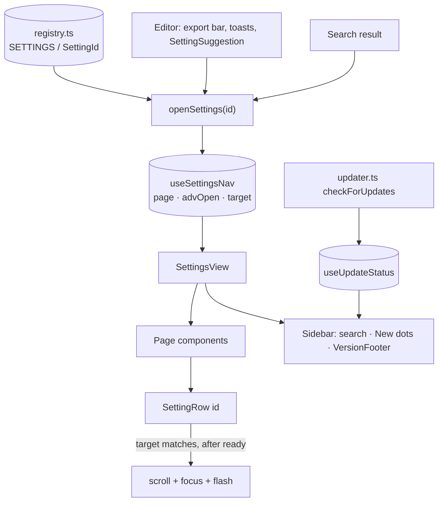
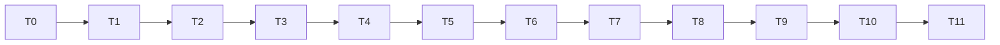

# Settings revamp — implementation plan (CP-0053), rev 2

- Design: [settings-revamp.md](settings-revamp.md) · Review findings: [settings-revamp-scrutiny.md](settings-revamp-scrutiny.md) · Prototype: https://claude.ai/artifact/93PBFjvXmZwG5ugbHu2jfK
- Base: `origin/main` @ `c24d7ca` (v0.13.0) → worktree `../capz-settings-revamp`, branch `feat/settings-revamp`
- **Rev 2 changes after 3 review passes:** OCR page dropped (no such setting exists) · legacy alias layer dropped (no external callers) · `pnpm lint` gate dropped (no such script) · test tooling made explicit · config fields moved into `general` · badge/suggestion logic fixed · web-version step dropped.

## Goal

1. Regroup Settings into **5** intent-based pages with a labeled sidebar; ≤6 everyday rows per page (shortcut rows count as one group), rest behind "Advanced (n)".
2. Settings search.
3. One navigation API `openSettings(id)` — from editor, toasts, search, and future callers — which also fixes today's dropped-deep-link race.
4. App version + live update status always visible at the sidebar bottom.
5. "New" badges and a reusable suggestion component (user asked to keep these in this PR).

## Facts this plan is built on (verified on origin/main)

| Fact | Evidence |
|---|---|
| No OCR setting exists anywhere | `git grep -i ocr src/components/settings src/lib/config.ts` → none |
| Deep-link senders are all in the editor webview | `page.tsx:415`, `page.tsx:510`, `Toolbar.tsx:1200` |
| Tray has no Settings entry; `show_settings_command` never called | `lib.rs:162` registration only |
| Settings mounts late and subscribes after async imports → messages get dropped (reason `focus` prop exists) | `SettingsView.tsx:141-192`, `page.tsx:707-711` |
| Update checks: manual button + `updater://check-now`; Rust waits 30 s and only fires when auto-check is on | `SettingsView.tsx:665`, `updater.ts:71-80`, `lib.rs:43-55` |
| `useUpdateCheckListener` runs in the editor window (same window as Settings) | `page.tsx:167` |
| `/paste` never renders Settings | no import of SettingsView/updater under `src/app/paste` |
| No `ui` config section; `validateConfig` warns on unknown top-level keys; `CONFIG_SCHEMA_VERSION = 2` | `config.ts:41-291, 297, 849-857` |
| No `lint` script; Vitest is node-env, `*.test.ts` only; no RTL/jsdom | `package.json`, `vitest.config.ts:9-10` |
| Web e2e reaches Settings only via the Tauri mock | `e2e/web/settings.spec.ts:4-5`, `platform.ts:5-9` |

**Per-task gate:** `pnpm tsc --noEmit && pnpm test:unit` (+ `pnpm test:e2e:web` where noted). No `pnpm lint`.

## Architecture



`openSettings` writes to a store that lives **outside** React, so a call made before Settings mounts is still there when it mounts — that is the fix for the dropped-message race, and T3 tests it directly.

## Tasks

### T0 — Worktree + test tooling
```bash
git fetch origin
git worktree add ../capz-settings-revamp -b feat/settings-revamp origin/main
cd ../capz-settings-revamp && pnpm install
pnpm add -D @testing-library/react @testing-library/dom jsdom
```
- `vitest.config.ts`: include `src/**/*.test.{ts,tsx}`, keep `environment: "node"` default and set `environmentMatchGlobs` (or per-file `// @vitest-environment jsdom`) for `.test.tsx`.
- Sanity: one trivial `.test.tsx` renders and passes. If jsdom proves painful, fall back to **plan B**: no RTL; the drift guard becomes a pure test over registry + a static `PAGE_ROWS` map that the page components consume, and rendering is covered by Playwright.
- Move the 3 design docs into this worktree and commit them first.

Commit: `chore(settings): worktree tooling for component tests`

### T1 — Registry (TDD)
`registry.test.ts` first: ids unique · every `page` in `PAGES` · every page has ≥1 non-advanced row · ≤6 non-advanced rows per page **excluding rows in the `Shortcuts` group** · `addedIn` valid semver · platform values are `"mac" | "windows"`.

```ts
export const PAGES = [
  { id: "capture", label: "Capture", lede: "Shortcuts and what happens the moment you capture." },
  { id: "editor",  label: "Editor",  lede: "How the annotation editor looks and behaves." },
  { id: "after",   label: "After capture", lede: "Where your screenshot goes." },
  { id: "library", label: "Library", lede: "Workspaces, saved captures and stickers." },
  { id: "app",     label: "App",     lede: "Startup, updates, privacy and troubleshooting." },
] as const;

export type SettingDef = {
  page: PageId; label: string; group?: string; advanced?: boolean;
  keywords?: string[]; platform?: "mac" | "windows"; addedIn?: string;
};
export const SETTINGS = { /* full table, see design doc + prototype */ } as const satisfies Record<string, SettingDef>;
export type SettingId = keyof typeof SETTINGS;
```
Rows that reviews found missing are included: `library.clear` ("Clear the saved list"), `app.skipped` ("Skipped version"), `capture.showEditor`. `library.stickers` stays **visible** (it opens the whole sticker form).

Commit: `feat(settings): add setting registry`

### T2 — Split SettingsView (pure move)
Move each tab body into `pages/{Capture,Editor,AfterCapture,Library,App}Page.tsx`; helpers into `cards/`. Old tabs keep rendering, 1:1, so behaviour is unchanged. `OutputPrefsForm` split into everyday/advanced exports. Gate also runs `pnpm test:e2e:web` — it must pass untouched.

Commit: `refactor(settings): split SettingsView into page components`

### T3 — Nav store + `openSettings` (TDD)
Tests: advanced id force-opens its page's fold · non-advanced id doesn't · repeated same-id call re-triggers (via `nonce`) · **`openSettings` called before SettingsView mounts still lands** (call, then mount, assert page/target) · unknown id is a typed error at compile time, so no runtime branch needed.

```ts
type NavState = { page: PageId; target: SettingId | null; advOpen: Partial<Record<PageId, boolean>>; nonce: number };
export const useSettingsNav = create<NavState & { setPage(p: PageId): void; toggleAdv(p: PageId): void; consumeTarget(): void }>(…);
export function openSettings(id: SettingId): void;
```
SettingsView seeds its first render from `useSettingsNav.getState()` and performs scroll/focus only once `ready` is true.

Commit: `feat(settings): add openSettings navigation API`

### T4 — `SettingRow` + `AdvancedSection`
- `SettingRow({ id, hint, children })`: label from registry, `data-setting-id`, returns `null` when `platform` ≠ `currentPlatform()`.
- On `target === id` && `ready`: `scrollIntoView` (`behavior: "auto"` under reduced motion), focus first control, `data-flash` for 1400 ms, `consumeTarget()`.
- `AdvancedSection({ page })`: `aria-expanded`, `Advanced (n)` counting only rows visible on this platform.

Commit: `feat(settings): setting rows with deep-link focus and advanced fold`

### T5 — Sidebar, regrouped pages, e2e selectors
- `SettingsSidebar` (nav + search slot + `VersionFooter`), `SettingsView` reduced to a shell; `TabsPrimitive`, `TAB_VALUES`, `FOCUS_TAB`, `SettingsFocus` deleted.
- Rows moved to their new page/fold per the design table; `onOpenInertRecovery` plumbed to `AppPage`.
- **Drift guard lands here** (not T4), now that the layout is final: render every page, collect `[data-setting-id]`, assert it equals the registry for the current platform, both platforms mocked.
- **e2e selectors updated in this commit** (role-based / `data-setting-id`) so CI never sees a broken spec.
- <720 px: icon rail; search becomes an icon + popover.
- Ladle story (`pnpm ladle`) for the sidebar — this repo uses Ladle, not Storybook.

Commit: `feat(settings): intent-based pages with labeled sidebar`

### T6 — Search
Filter over `SETTINGS` (label + keywords + page label, platform-filtered); results show `Page › Advanced`; ↑/↓, Enter opens first, Esc clears; `⌘F`/`Ctrl+F` handled inside SettingsView with `preventDefault` (no existing handler conflicts; WebView2 find-in-page untested).

Commit: `feat(settings): search settings`

### T7 — Version footer
```ts
export const useUpdateStatus = create<{ state: "idle"|"checking"|"ok"|"available"|"error"; version?: string; error?: string; at?: number }>(…);
export function useAppVersion(): string | null;   // reuses the getVersion call extracted from AboutRow
```
- `checkForUpdates` sets `checking` → `ok` / `available` / `error`. Both existing callers flow through it, and the listener runs in the editor window, so the footer is live.
- Idle text derives from `updates.lastCheckedAt`, but since that is written on failure too, the footer shows "Last check failed" when the last result was an error, and "Auto-check is off" when `updates.auto` is false. No spinner during the first 30 s — Rust hasn't asked for a check yet.
- Click → `openSettings("app.updates")`. `AboutRow` keeps Tauri version + platform.
- Desktop only; no `next.config.ts` change (Settings never renders on `/paste`).
- Tests: `updater.test.ts` mocks the plugin and asserts the status transitions incl. error; footer text per state.

Commit: `feat(settings): live app version and update status in sidebar`

### T8 — Rewire deep links (delete the event hop)
- `page.tsx` `editor:show-settings` → `setView("settings")` + `openSettings(...)` for a known id; payloads are now ids, and `settings:focus-tab` plus the `settingsFocus` prop are **deleted** (no external senders exist).
- `page.tsx:510` toast "Pick folder" → `openSettings("after.folder")`; `Toolbar.tsx:1200` → `openSettings("after.format")`; history button → `openSettings("library.history")`.
- `editor.rs`: doc comment only — `tab` becomes `setting`, still a passthrough string; note in the doc that the command currently has no caller.
- `git grep "focus-tab\|SettingsFocus"` must come back empty.

Commit: `refactor(settings): route all deep links through openSettings`

### T9 — New badges + suggestions
- Config: add to the **existing `general` section** (no new top-level key, so `validateConfig`'s unknown-key warning stays quiet): `lastSeenSettingsVersion: string` (default `""`) and `dismissedSuggestions: string[]` (default `[]`). Add to `DEFAULT_CONFIG` + `validateConfig`; `CONFIG_SCHEMA_VERSION` stays 2 — added optional fields with defaults need no migration (assert in `settings.test.ts` that an old config still loads).
- Writes go through a dedicated store action that is **excluded from the autosave signature** (`configSig`), so viewing a page doesn't fire the "Saved" toast.
- `isNew(id)`: `addedIn && semverGt(addedIn, lastSeenSettingsVersion)`. `""` (fresh install) ⇒ nothing is new; set it to the current version on first run.
- **Clearing is per page, on view** (design's original rule): visiting a page marks every new row on it seen — tracked as a set of ids in the config field's companion, not "all pages in one session", and platform-hidden rows are treated as seen so they can never block clearing.
- `SettingSuggestion({ id, title, body, cta })`: hidden when dismissed; "Not now" persists; CTA switches view + `openSettings(id)`. Ladle story only; no trigger wired.
- No existing setting gets `addedIn` in this PR, so no badge appears until a genuinely new setting lands.

Commit: `feat(settings): new-setting badges and suggestion component`

### T10 — Copy pass
| Old | New |
|---|---|
| Capture intermediate | Temporary capture format |
| Limit longest edge (px) | Shrink large images |
| Default output | After capturing |
| On editor close/hide | On closing the editor |
| Editor window always on top | Keep editor on top |
| Re-run onboarding | Run setup again |

Commit: `feat(settings): plain-language labels`

### T11 — Verify
- New `e2e/web/settings-nav.spec.ts`: search → jump opens Advanced + focuses row; footer visible on every page (mock must answer `plugin:app|version` — add a handler if missing); narrow viewport → icon rail.
- `pnpm test:unit`, `pnpm test:e2e:web`, `pnpm tsc --noEmit`. Rust untouched except a comment → `cargo clippy` only if that changes.
- Mac build via the mac-app-build skill; manual QA added to `docs/manual-qa.md`: toast "Pick folder" lands on the right row, mac-only rows hidden on Windows, footer states (auto-check off / failed check / update available), reduced-motion.
- Update `PROGRESS-FEATURE.md`; move CP-0053 to review.

Commit: `test(settings): e2e for navigation, search, version footer`

## Order


One PR, reviewable per commit. Split point if it grows too large: T0–T4 + T8 (plumbing, no visual change) / T5–T7 + T10 (the visible revamp) / T9 (badges).

## What actually happened (build log)

- **T2 merged into T5.** A "pure move" of the old tab bodies followed by a regroup meant rewriting the same JSX twice; the split and the regroup landed in one commit, with the drift test as the safety net instead.
- **Vitest needed `esbuild: { jsx: "automatic" }`** on top of jsdom + RTL, and RTL does not auto-clean without Vitest globals — component tests call `cleanup()` themselves.
- **The component test found a real bug:** consuming the nav target re-ran `SettingRow`'s effect, whose cleanup cancelled the scroll frame it had just queued. Fixed with a handled-nonce guard.
- **`RingModesField` read the platform at module scope**, which no test could vary; it now reads it per render.
- **The e2e mock had no `plugin:app|version`** (the review predicted this) — added, along with `tauri_version` and `name`.
- **Not verified on this box:** `pnpm test:e2e:web` cannot run (Playwright ships no browser for Ubuntu 26.04 and none is cached), and `pnpm build` needs network for Google Fonts. Both run in CI; the Mac build is a separate pass.

## Remaining risks

| Risk | Mitigation |
|---|---|
| jsdom/RTL setup fights the Next.js + Tauri import graph | plan B in T0: pure drift-guard test + Playwright coverage |
| `pnpm test:e2e:web` mock lacks `plugin:app|version` → footer test fails | check the mock in T7, extend it there |
| Registry drifts from rendered rows | drift guard in T5, both platforms |
| Deep link fires before mount | store-based, with an explicit test in T3 |
| CI does not build Rust on PRs | Mac build before merge (T11) |
| Reduced-motion / focus theft while typing in search | focus only on explicit navigation, never on keystrokes |
