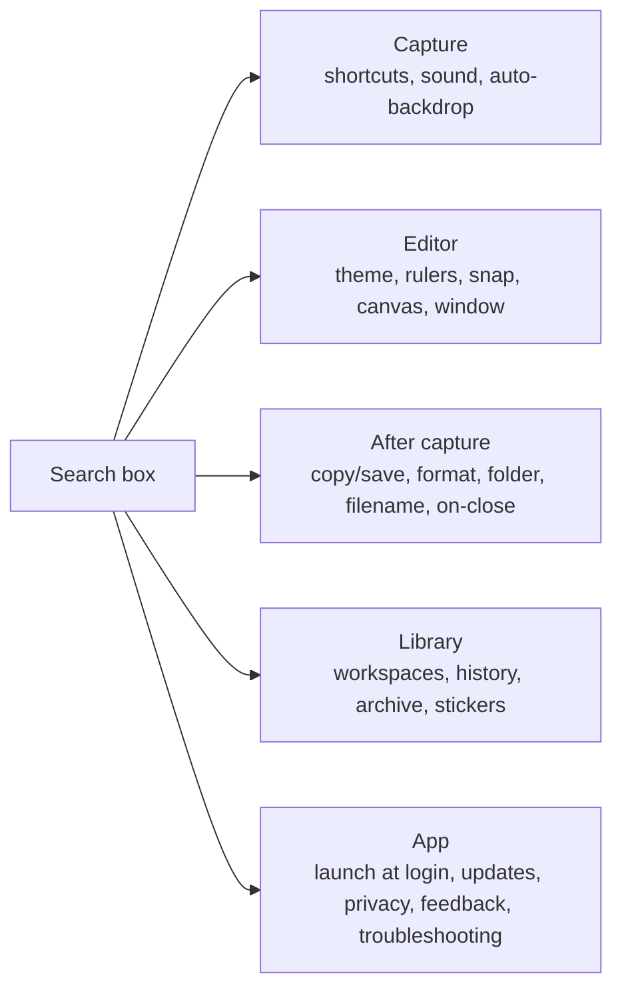

# Settings revamp: design + plan

Status: approved, in build · Base: `origin/main` @ `c24d7ca` (v0.13.0) · Scope: `src/components/settings/*` (+ two new `general` config fields; no Rust changes)

Reviewed 3× — findings and fixes: [settings-revamp-scrutiny.md](settings-revamp-scrutiny.md). **There is no OCR setting on main**, so the "Text recognition" page is dropped: 5 pages.

## 1. What's overwhelming today (audit of origin/main)

`SettingsView.tsx` is 1,115 lines. It has **6 icon-only tabs** and **~45 controls**.

| Tab | Controls | Problem |
|---|---|---|
| Shortcuts | 7 hotkeys + ring modes | Fine, but "Command ring (hold)" and ring modes need explaining |
| Output | intermediate format, temp JPEG quality, longest-edge limit, default output, file format, JPEG quality, save folder, filename template | Mixes **internal pipeline knobs** ("Capture intermediate") with the everyday "where does my screenshot go" |
| Stickers | sticker library | OK |
| **General** | appearance, launch at login, sound, remember tool, rulers, snap, canvas bg, auto-backdrop ×N, on-close action, always on top, window size, re-run onboarding, fix macOS permission, reset, about, workspaces ×3, capture history ×4, archive ×3 | **Junk drawer**: ~15 rows plus the workspaces, history and archive cards, in one scroll |
| Updates | auto-check, install ID, interval, last checked | Fine |
| Feedback | form | It's an action, not a setting |

Root causes:
1. **Nav has no words.** Icon-only tabs; you hover to find anything.
2. **Grouped by implementation, not by intent.** "What happens after I capture" is split across Output (default output) and General (on-close action, auto-backdrop, history, archive).
3. **Everything is equally loud.** Pipeline tuning (intermediate JPEG quality, longest edge, window px size) sits beside "Dark mode".
4. **Destructive/rare actions inline** with preferences (Reset, TCC fix, onboarding).
5. **Hint walls**: long gray hints under every row.
6. **No search.**

## 2. Design

### Direction
Settings is a place you visit to change *one thing* and leave. So the design's one bold move is **findability**: a labeled sidebar ordered by the capture journey plus instant search. Everything else stays quiet and uses the existing capz tokens (`surface`, `tile-icon`, `headline`, `SettingsRow` pattern). No new palette.

Principles:
- **Group by what the user is trying to do**, in the order they meet it: capture → edit → save/share → app.
- **Defaults visible, tuning folded.** Each page shows 3–6 everyday rows; the rest sits behind one "Advanced" disclosure at the bottom of that page.
- **One line of hint max**; longer explanation goes in a `(?)` tooltip.
- **Actions are not settings.** Reset/onboarding/permission fix/feedback move to an "App" page, under a "Troubleshooting" block.
- Plain words: "Capture intermediate" → "Temporary capture format".

### New information architecture



| Page | Everyday (visible) | Advanced (folded) |
|---|---|---|
| **Capture** | 4 capture shortcuts (full, area, window, scrolling), command ring shortcut, play sound | "Show editor" shortcut, ring hold key + ring modes, macOS system area capture, auto-backdrop per type |
| **Editor** | appearance, remember last tool, snap | rulers, canvas background, always on top, default window size |
| **After capture** | when I capture: copy / save / both, save folder, file format | filename template, JPEG quality, longest-edge limit, temporary format + quality, on-editor-close action |
| **Library** | multiple workspaces, remember saved files (show as), manage stickers | max workspaces, new-capture behavior, keep last N, clear the saved list, archive + limit + usage |
| **App** | launch at login, auto-check updates, about/version, send feedback | install ID, interval, last checked, skipped version; *Troubleshooting*: re-run onboarding, fix macOS permission, reset settings |

Result: first view of any page ≤ 6 rows (vs the whole General tab today). Shortcut rows on Capture count as one group for that rule.

### Layout

```
┌──────────────────────────────────────────────────────────────┐
│ ┌──────────────────┐  After capture                          │
│ │ 🔍 Search…   ⌘F  │  Where your screenshot goes.            │
│ ├──────────────────┤                                         │
│ │ ◉ Capture        │  When I capture   [Copy ▾]              │
│ │ ○ Editor         │  Save folder      ~/Pictures  [Change]  │
│ │ ● After capture  │  File format      (PNG)(JPEG)(WebP)     │
│ │ ○ Library        │                                         │
│ │ ○ App            │  ▸ Advanced (5)                         │
│ ├──────────────────┤                                         │
│ │ capz 0.13.0      │                                         │
│ │ ● Up to date     │                                         │
│ └──────────────────┘                                         │
└──────────────────────────────────────────────────────────────┘
```

- Sidebar: icon **+ label**, 200px, left aligned. Collapses to icon rail below 720px editor width.
- Page header: title + one sentence. No large tile icon (saves ~80px).
- Rows: label left, control right (existing `SettingsRow`). Segmented control replaces selects with ≤3 options.
- "Advanced (n)" disclosure shows count; open state remembered per page in memory only (no localStorage — CLAUDE.md rule).
- Search: filters a static registry of `{id, page, label, keywords, advanced}`; results list jumps to the page, auto-opens Advanced if needed, and flashes the row (single motion moment; respects `prefers-reduced-motion`).
- Autosave + "Saved" toast unchanged. UI-state writes (last-seen version, dismissed tips) must not trigger it.
- Version footer pinned to the sidebar bottom: `capz <version>` + live update status; click opens the Updates setting.

## 3. Implementation plan

Moved to [settings-revamp-implementation.md](settings-revamp-implementation.md) (task-by-task, revised after review). Prototype: https://claude.ai/artifact/93PBFjvXmZwG5ugbHu2jfK
