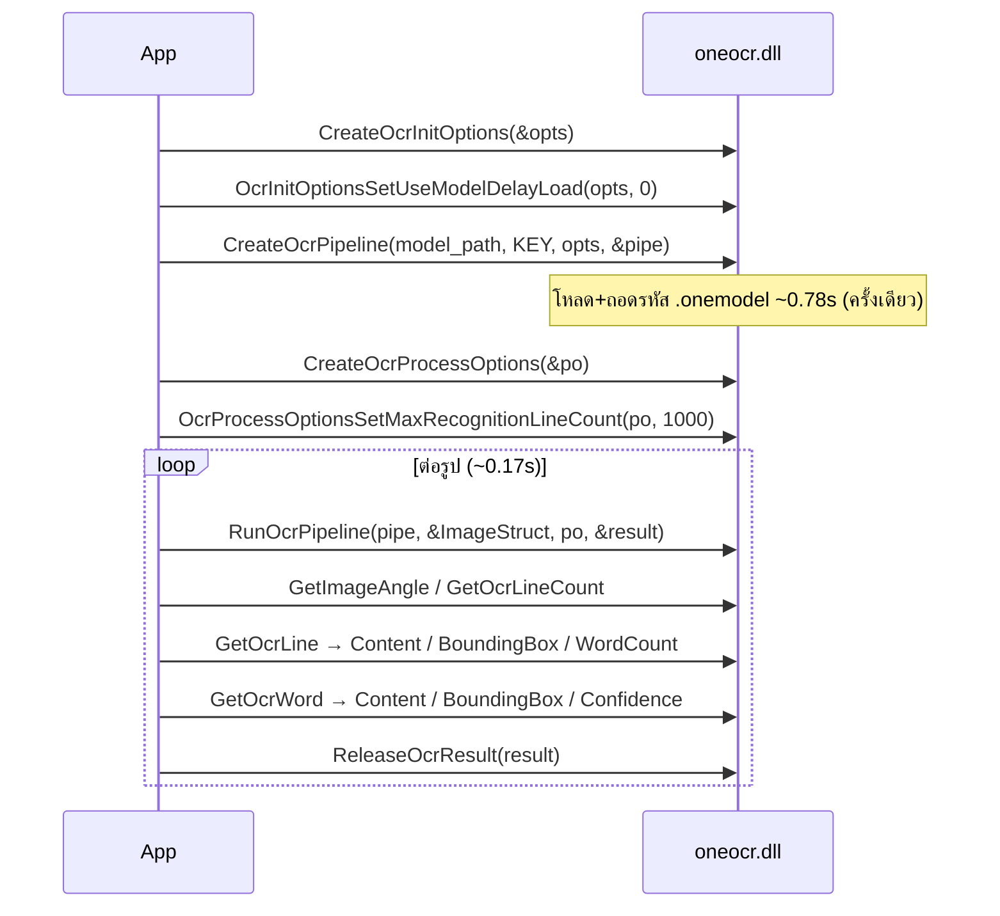

# OneOCR (win-ocr) กับ OCR ภาษาไทยบน Windows ของ capz

*วิจัย + scrutinize 2 รอบ · 19 ส.ค. 2026 · source: `~/development/win-ocr` (clone จาก `panupongkongkate/win-ocr`)*

---

## TL;DR (แก้แล้วหลัง scrutinize)

1. **บั๊กที่ต้องแก้ทันที ไม่เกี่ยวกับ OneOCR:** ทั้ง `docs/OCR-THAI-WINDOWS.th.md` **และ toast ที่
   `src/stores/ocr.ts:66-73`** สอนผู้ใช้ให้ติดตั้ง Thai OCR language pack — **แพ็กนั้นไม่มีอยู่จริง**
   (ยืนยันจาก FOD table ของ Microsoft: OCR FOD 35 ภาษา ไม่มี `th`)
   ซ้ำร้าย toast นี้เด้ง **ทุกครั้งที่ผู้ใช้ Windows กด Detect text ครั้งแรก แม้รูปจะเป็นอังกฤษล้วน**
2. **OneOCR อ่านไทยได้จริง แต่ผมไม่แนะนำให้ทำตอนนี้** — มี 3 blocker ที่รอบแรกผมมองข้าม:
   ขนาดรูปจำกัด 50–10000px ซึ่ง**ชนกับ scrolling capture ของเราตรง ๆ**,
   เราไม่มีเครื่อง Windows ให้ทดสอบและ CI ไม่ build Rust ตอน PR, และแผนพิสูจน์ที่ผมเสนอรอบแรก
   **คุณรันไม่ได้เลยเพราะไม่มีเครื่อง Windows**
3. **ทางเลือกที่รอบแรกผมไม่ได้เสนอ และน่าจะดีกว่า: Tesseract + `tha.traineddata`**
   (Apache-2.0, redistribute ได้ถูกกฎหมาย, ข้ามแพลตฟอร์ม, ทดสอบบน Linux/Mac ได้)

---

## 0. ทางเลือกอื่นก่อนจะไปต่อ (รอบแรกผมข้ามขั้นนี้)

รอบแรกผมนำเสนอเป็นทางเลือกสองทาง — "อยู่กับ `Windows.Media.Ocr` ต่อ" หรือ "ทำ OneOCR"
ซึ่งเป็น false dichotomy จริง ๆ มีอย่างน้อย 4 ทาง:

| ทาง | ไทย | ความเสี่ยงกฎหมาย | ทดสอบจากเครื่องเราได้ | ข้ามแพลตฟอร์ม |
|---|---|---|---|---|
| **A. แก้เอกสาร + toast แล้วจบ** | ❌ | ไม่มี | ✅ | — |
| **B. Tesseract + `tha.traineddata`** | ✅ พอใช้ | **ไม่มี** (Apache-2.0) | ✅ | ✅ |
| **C. OneOCR FFI** | ✅ ดีมาก | 🔴 สูง | ❌ | ❌ Windows only |
| D. Cloud OCR | ✅ | ไม่มี | ✅ | ✅ |

- **D ตกไปทันที** — `CLAUDE.md` ระบุ "No backend API, no telemetry, no cloud in v1" เป็นข้อกำหนดโปรเจกต์
- **B คือทางที่รอบแรกผมพลาดไม่ได้พูดถึงเลย** ทั้งที่มันตอบโจทย์ ~80% ด้วยความเสี่ยง ~5%:
  `tha.traineddata` แจกได้ตามกฎหมาย ไม่ต้องแตะ binary ของ Microsoft ไม่ต้องพึ่ง undocumented API
  ที่พังได้ทุก Windows update และ **ผมทดสอบคุณภาพให้คุณได้เลยจากเครื่อง Linux นี้** — ไม่ต้องรอเครื่อง Windows
  ข้อเสีย: ช้ากว่า (~1–3 วิ/รูป), แม่นน้อยกว่า OneOCR ชัดเจนบนไทย, เพิ่มขนาด installer ~15MB
- **A คือสิ่งที่ต้องทำอยู่ดีไม่ว่าจะเลือกอะไร** เพราะมันแก้ *ความเสียหายที่เกิดกับผู้ใช้จริงตอนนี้*

**ข้อเสนอ: ทำ A ทันที → วัด B จากเครื่องนี้ → ค่อยพิจารณา C ถ้า B ไม่ผ่านเกณฑ์**

---

## 1. สถานะปัจจุบันของเรา

| ไฟล์ | บทบาท |
|---|---|
| `src-tauri/src/services/ocr/mod.rs` | `OcrBackend` trait + `run_detect` + `pick_languages` (unit test ครบ) |
| `src-tauri/src/services/ocr/windows.rs` | backend `Windows.Media.Ocr` (WinRT) |
| `src-tauri/src/services/ocr/macos.rs` | backend Vision |
| `src-tauri/src/commands/ocr.rs` | `ocr_detect`, `spawn_blocking` |
| `src/stores/ocr.ts:63-74` | toast แจ้งเตือนเมื่อ `!thaiAvailable` — ครั้งเดียวต่อ session |
| `docs/OCR-THAI-WINDOWS.th.md` | คู่มือให้ผู้ใช้ลง Thai OCR pack |

---

## 2. หลักฐาน: Thai OCR FOD ไม่มีอยู่จริง

ดึง [FOD-to-LP Mapping Table](https://download.microsoft.com/download/7/6/0/7600F9DC-C296-4CF8-B92A-2D85BAFBD5D2/Windows-10-1809-FOD-to-LP-Mapping-Table.xlsx)
มาแกะ sharedStrings แล้วกรอง `Microsoft-Windows-LanguageFeatures-OCR-*`:

```
35 ภาษา:
ar-sa bg-bg bs-latn-ba cs-cz da-dk de-de el-gr en-gb en-us es-es es-mx fi-fi
fr-ca fr-fr hr-hr hu-hu it-it ja-jp ko-kr nb-no nl-nl pl-pl pt-br pt-pt ro-ro
ru-ru sk-sk sl-si sr-cyrl-rs sr-latn-rs sv-se tr-tr zh-cn zh-hk zh-tw
```

`th` **ไม่อยู่ในรายการ** — ในตารางมีแค่ `Language.Fonts.Thai` (ฟอนต์) ซึ่งไม่เกี่ยวกับ OCR

> ⚠️ **ข้อจำกัดของหลักฐาน:** ตารางนี้เป็นของ Windows 10 1809 (Microsoft ไม่เคยอัปเดตอีก
> แต่หน้า docs ปัจจุบันยังลิงก์ตัวนี้อยู่) ผมรัน `Get-WindowsCapability` จาก Linux ไม่ได้
> **ต้องให้คุณยืนยันบน Windows ก่อนแก้เอกสาร:**
> `Get-WindowsCapability -Online -Name "Language.OCR*" | Select Name,State`

**หลักฐานเก็บไว้ในรีโปแล้ว** (รันซ้ำได้เอง ไม่ต้องเชื่อตัวเลขในเอกสารนี้):

```bash
python3 docs/research/evidence/extract-ocr-fods.py \
        docs/research/evidence/Windows-10-1809-FOD-to-LP-Mapping-Table.xlsx
# → 35 OCR FODs: ar-sa bg-bg ... zh-tw
# → thai present: False
```


---

## 3. OneOCR ทำงานอย่างไร (อ่านจาก `oneocr/oneocr.py` ทั้งไฟล์)

C ABI 16 ฟังก์ชัน โหลดผ่าน `ctypes.WinDLL`:



Contract ที่ต้องรู้:

- ทุกฟังก์ชันคืน `int64`, **`0 = success`** (ยกเว้น `Release*` คืน void)
- **input เป็น raw buffer ไม่ใช่ path** — `ImageStructure { type=3, width, height, _reserved, step_size(i64), data_ptr }`,
  **BGRA 8-bit, step = width*4**
- **bounding box เป็นสี่เหลี่ยม 4 จุด (x1..y4) ไม่ใช่ axis-aligned rect**
- โมเดลเข้ารหัส ปลดล็อกด้วยคีย์ 32 ไบต์ที่ hardcode อยู่ใน `oneocr.py`
  *(ไม่คัดลอกคีย์มาไว้ในเอกสารนี้ — ดูเหตุผลข้อ 4A)*
- **ข้อจำกัดขนาดรูป 50–10000 px ทั้งกว้างและสูง** (`oneocr.py` เช็คเองแล้ว return error)
- pipeline ใช้ซ้ำได้ แต่ init ครั้งเดียวต่อ process

---

## 4. Findings จาก scrutinize 2 รอบ

### 🔴 A. ลิขสิทธิ์ / DMCA

`.onemodel` เข้ารหัสไว้ และ repo นั้นแจกทั้งไฟล์โมเดล + คีย์ถอดรหัสคู่กัน
การเข้ารหัสคือ technological protection measure — การแจกคีย์คู่กับไฟล์เข้าข่าย
circumvention ไม่ใช่แค่ redistribution ธรรมดา

capz มี signed installer + auto-updater → DMCA takedown = ช่องทางแจกจ่ายพังทั้งหมด

**ทางที่พอรับได้ (ถ้าจะทำจริง):** resolve DLL จากเครื่องผู้ใช้เท่านั้น ไม่ bundle อะไรเลย

> **รอบสองจับได้ว่าเอกสารรอบแรกผิดกฎของตัวเอง:** ผมเขียนว่า "ห้ามแจกคีย์"
> แต่ดันคัดลอกคีย์ 32 ไบต์นั้นมาแปะไว้ในเอกสารนี้ซึ่งอยู่ในรีโป capz เอง
> = capz กลายเป็นแหล่งแจกจ่ายคีย์เสียเอง **ลบออกแล้ว** ถ้าจะเขียนโค้ดจริงให้อ่านคีย์จาก
> `~/development/win-ocr` (นอกรีโป) และห้าม commit เข้ามา

### 🔴 B. ขนาดรูป 50–10000 px ชนกับ scrolling capture ของเราตรง ๆ

`src-tauri/src/services/stitch.rs:454` — accumulator โตแบบ `ah + rows` ต่อเฟรม **ไม่มีเพดาน**
scrolling capture หน้าเว็บยาว ๆ บนจอ 1080p ทะลุ 10000px ได้ง่ายมาก
→ OneOCR จะ **reject รูปทั้งใบ** ไม่ใช่อ่านได้บางส่วน

และปลายอีกด้าน: area selection ครอบข้อความบรรทัดเดียวสูง < 50px ก็ถูก reject เหมือนกัน
ซึ่งเป็น use case ที่คนใช้บ่อยที่สุดของ "Detect text"

`Windows.Media.Ocr` ปัจจุบันไม่มีข้อจำกัดนี้ → **นี่คือการถอยหลัง ไม่ใช่การอัปเกรด**
ถ้าจะทำต้องเพิ่ม tiling layer (ซอยรูปเป็นแถบ + merge ผลลัพธ์ + จัดการบรรทัดที่ถูกตัดคร่อมรอยต่อ)
ซึ่งเป็นงานที่ใหญ่กว่าตัว FFI binding เองมาก — รอบแรกผมประเมินขนาดงานต่ำไปมาก

### 🔴 C. เราไม่มีทางทดสอบโค้ดนี้ได้เลย

- `.github/workflows/build.yml:3-7` — trigger แค่ `workflow_dispatch` กับ tag `v*`
  → **PR ไม่เคย build Rust เลย** โค้ด Windows ถูกคอมไพล์ครั้งแรกตอน release เท่านั้น
- `windows.rs:18-22` มี header เตือนไว้แล้วว่า *"NOT compiled / verified on macOS —
  A Windows developer must run cargo check"* → แม้แต่ WinRT backend ที่ปลอดภัยกว่านี้มาก
  ก็ยังไม่มีใครยืนยัน
- environment เราคือ Linux headless + Mac ผ่าน SSH — **ไม่มีเครื่อง Windows**

การเอา **unsafe FFI ที่พังแล้ว crash ทั้งโปรเซส** ไปวางบนฐานที่ไม่มี CI ไม่มีเครื่องทดสอบ
คือการเซ็นเช็คเปล่า อย่างน้อยต้องเพิ่ม `cargo check --target x86_64-pc-windows-msvc` เข้า PR CI ก่อน

### 🔴 D. แผน "ขั้นที่ 1" ของรอบแรกคุณรันไม่ได้

รอบแรกผมเขียนว่า *"รัน `python example.py` บน screenshot จริง 10–15 รูป"*
แต่ `oneocr.dll` เป็น **Windows x64 DLL โหลดผ่าน `ctypes.WinDLL`** — รันบน Linux หรือ macOS ไม่ได้
ผมเสนอขั้นตอนพิสูจน์ที่คุณทำไม่ได้ ถือเป็นข้อบกพร่องหลักของรายงานรอบแรก

→ ถ้าจะวัด OneOCR จริงต้องยืมเครื่อง Windows / VM ก่อน
→ ตรงข้ามกับ **ทางเลือก B (Tesseract) ที่ผมวัดให้ได้เดี๋ยวนี้จากเครื่องนี้**

### 🟠 E. Toast ภาษาไทยเด้งใส่ผู้ใช้ที่ไม่ได้ใช้ภาษาไทย

trace: `src/stores/ocr.ts:63` → `if (!result.thaiAvailable && !thaiNoticeShown)`
เงื่อนไขนี้**ไม่ได้ดูเลยว่าในรูปมีภาษาไทยหรือไม่** และ `thai_available` บน Windows
เป็น `false` เสมอ (เพราะ FOD ไม่มีจริง ข้อ 2)

→ ผู้ใช้ Windows **ทุกคนทั่วโลก** กด Detect text ครั้งแรกบน screenshot อังกฤษล้วน
จะได้ toast ภาษาไทยยาว 15 วินาที บอกให้ไปติดตั้งของที่ไม่มีอยู่จริง

เป็นบั๊กที่ต้องแก้แยกต่างหาก ไม่เกี่ยวกับว่าจะเลือก engine ไหน

### 🟠 F. bounding box เป็น quadrilateral — schema เราไม่รองรับ

`OcrBox { x, y, w, h }` axis-aligned ล้วน แต่ OneOCR คืน 8 ค่า
- **ระยะสั้น:** ยุบเป็น AABB (min/max ของ 4 จุด) — เสีย fidelity บนรูปเอียง แต่ไม่ต้องแตะ frontend
- **ระยะยาว:** เพิ่ม `quad?` optional แล้วให้ `OcrLayer.tsx` ใช้ CSS transform

### 🟠 G. `pick_languages()` จะไร้ความหมาย

OneOCR เป็น multilingual model ตัวเดียว **ไม่มีพารามิเตอร์ภาษา** — ไม่มีจุดส่ง `["en-US","th-TH"]` เข้าไป
`available_languages()` ต้อง hardcode และ `thai_available` เป็น `true` เสมอ
→ ควรทบทวนว่า `languages` ควรอยู่ใน `OcrBackend` trait หรือไม่

### 🟡 H. benchmark ยังไม่ผ่านการตรวจสอบอิสระ

"0.17 วิ/รูป", "ไทยแม่นระดับใช้งานจริง" มาจาก **รูปเดียว** บนเครื่องเดียว
และเป็นหน้านิยายพิมพ์สะอาด contrast สูง = best case ของ OCR ทุกตัว
ยังไม่มีหลักฐานสำหรับ use case จริงของ capz: UI screenshot ตัวเล็ก anti-aliased dark mode

**ผมเองก็ยังไม่ได้รันซ้ำ** (ข้อ D) — ทุกตัวเลขในรายงานนี้เป็น *ข้ออ้างของ repo นั้น* ไม่ใช่การวัดของเรา

### 🟡 I. ความเปราะของ FFI

- Windows update เปลี่ยน struct layout / export → **crash ทั้งโปรเซส ไม่ใช่ error** Rust ดักไม่ได้
- `RunOcrPipeline` ไม่มีหลักฐานว่า thread-safe → ต้อง `Mutex`
- **sidecar process** ปลอดภัยกว่า (ตายก็แค่ OCR ล้ม ไม่ลากแอปลง) แต่ต้องเขียน+ship exe เพิ่ม
  และตั้ง Tauri sidecar bundling สำหรับ Windows — ต้นทุนไม่เล็ก ต้องนับรวมตอนตัดสินใจ
- RSS impact: DLL 42.7MB + model 58MB **ต้องวัดจริง** (รอบแรกผมเดาว่า "~115MB" ซึ่งไม่มีหลักฐาน)

### 🟢 J. ของแถมที่ควรเก็บไม่ว่าเลือกทางไหน

- `confidence` ต่อคำ → กรองบรรทัดขยะออกจาก `OcrLayer`
- `text_angle` → แก้ overlay วางเพี้ยนบนภาพเอียง

*(รอบแรกผมเขียนว่า "macOS Vision มีสองค่านี้อยู่แล้วแค่ยังไม่ดึง" — ตรวจแล้ว `macos.rs:101`
ใช้ `topCandidates(1)` จริง และ `VNRecognizedText` มี `.confidence` ตาม API ของ Apple
แต่**ผมยังไม่ได้ยืนยันว่า binding `objc2-vision 0.3` expose มันออกมา** — ถือเป็นข้อสันนิษฐาน)*

---

## 5. ข้อเสนอสุดท้าย

### ขั้นที่ 0 — ทำทันที (ไม่ต้องรอตัดสินใจเรื่อง engine)
1. ยืนยันด้วย `Get-WindowsCapability -Online -Name "Language.OCR*"` บนเครื่อง Windows
2. แก้ `docs/OCR-THAI-WINDOWS.th.md` — หยุดสอนสิ่งที่ทำไม่ได้
3. **แก้ toast ที่ `src/stores/ocr.ts:66-73` ด้วย** (รอบแรกผมลืมข้อนี้ — ข้อความผิดฝังอยู่ใน
   โค้ดโดยตรง ไม่ใช่แค่ในไฟล์ .md)
4. แก้เงื่อนไขข้อ E ให้ toast เด้งเฉพาะเมื่อเกี่ยวข้องจริง

### ขั้นที่ 1 — วัด Tesseract จากเครื่องนี้
ผมทำได้เลยวันนี้: เก็บ screenshot จริงจาก capz 10–15 รูป (ไทย/อังกฤษ, light/dark, ตัวเล็ก, UI)
รัน `tha.traineddata` เทียบผล ถ้าคุณภาพรับได้ → จบเรื่อง ไม่ต้องแตะ OneOCR เลย

### ขั้นที่ 2 — พิจารณา OneOCR เฉพาะเมื่อ Tesseract ไม่ผ่าน
และต้องปลดล็อกทั้ง 4 blocker ก่อน: กฎหมาย (A), tiling สำหรับรูปเกิน 10000px (B),
CI + เครื่องทดสอบ Windows (C), และหาเครื่อง Windows มาวัด (D)

### คำถามที่ยังต้องการคำตอบจากคุณ
- capz มีแผนเชิงพาณิชย์ไหม? กระทบข้อ A โดยตรง
- ให้ผมลองวัด Tesseract เลยไหม? เป็นทางเดียวที่เดินหน้าได้โดยไม่ต้องรอเครื่อง Windows

---

## Verdict

**รายงานรอบแรก: rework** — ไม่ใช่เพราะข้อเท็จจริงผิด (หลักฐานเรื่อง FOD ยังยืนอยู่และเป็นของจริง)
แต่เพราะมันเสนอทางเลือกเดียวโดยไม่ได้ชั่งกับ Tesseract, ประเมินขนาดงานต่ำไปเพราะไม่เห็นข้อจำกัด
10000px, และจบด้วยแผนพิสูจน์ที่ผู้อ่านรันไม่ได้

**ข้อเสนอปัจจุบัน (ขั้นที่ 0 → 1): ship** — ขั้นที่ 0 แก้ความเสียหายที่เกิดกับผู้ใช้จริงตอนนี้
ด้วยความเสี่ยงศูนย์ และไม่ผูกมัดการตัดสินใจเรื่อง engine เลย


---

## 6. สถานะ ณ 27 ส.ค. 2026 — สำหรับหยิบงานต่อ

**ยังไม่มีการแก้โค้ดใด ๆ** เอกสารนี้ + `docs/research/evidence/` คือ output ทั้งหมด
`git status` สะอาดนอกจาก `docs/research/` ที่ยัง untracked

**ของที่อยู่บนดิสก์แล้ว:**
- `docs/research/2026-08-19-oneocr-windows-thai.md` — เอกสารนี้
- `docs/research/evidence/` — ตาราง FOD ของ Microsoft + สคริปต์แกะ (รันซ้ำได้)
- `~/development/win-ocr/` — clone ของ repo ต้นทาง (188MB, **อยู่นอกรีโป capz โดยตั้งใจ**
  เพราะมี binary + คีย์ของ Microsoft ห้าม commit เข้ามาเด็ดขาด — ดูข้อ 4A)

**สิ่งที่ต้องทำต่อ เรียงตามลำดับ:**

1. **[รอผู้ใช้]** ยืนยันบนเครื่อง Windows:
   `Get-WindowsCapability -Online -Name "Language.OCR*" | Select Name,State`
   — เป็นด่านสุดท้ายก่อนแก้เอกสาร เพราะตาราง FOD ที่ใช้เป็นหลักฐานเป็นของ Win10 1809
2. แก้ `docs/OCR-THAI-WINDOWS.th.md` — หยุดสอนวิธีติดตั้งสิ่งที่ไม่มีอยู่จริง
3. แก้ toast ที่ `src/stores/ocr.ts:66-73` — ข้อความผิดฝังอยู่ใน**โค้ด** ไม่ใช่แค่ไฟล์ .md
4. แก้เงื่อนไข `src/stores/ocr.ts:63` — ตอนนี้ toast เด้งใส่ผู้ใช้ Windows ทุกคน
   แม้รูปจะเป็นอังกฤษล้วน (ข้อ 4E)
5. **[รอผู้ใช้ตัดสินใจ]** ให้วัด Tesseract + `tha.traineddata` จากเครื่อง Linux นี้ไหม
   — เป็นทางเดียวที่เดินหน้าได้โดยไม่ต้องรอเครื่อง Windows
6. พิจารณา OneOCR เฉพาะเมื่อ Tesseract ไม่ผ่าน และต้องปลด blocker A/B/C/D ก่อน

**คำถามค้างที่ต้องการคำตอบ:** capz มีแผนเชิงพาณิชย์ไหม (กระทบข้อ 4A โดยตรง)

> ข้อควรระวังถ้ามาทำต่อ: ข้อ 2–4 ต้องแตะโค้ดจริง → ตาม `CLAUDE.md` ต้อง
> `git fetch origin` แล้วเปิด worktree ใหม่จาก `origin/main` ก่อนแก้

---

## §7 อัปเดต 27 ส.ค. 2026 — ลงมือแก้ข้อ 2–4 แล้ว

worktree: `~/development/capz-thai-ocr-fix` (branch `fix/thai-ocr-impossible-guidance`, ฐานจาก `origin/main` @ cb82d63) — **ยังไม่ commit**

| ข้อ | สถานะ |
|---|---|
| 2. `docs/OCR-THAI-WINDOWS.th.md` | ✅ เขียนใหม่ทั้งไฟล์ — บอกตรง ๆ ว่าไม่มีของให้ติดตั้ง + ยอมรับว่าคำแนะนำเดิมผิด + ให้คำสั่ง `Get-WindowsCapability` ไว้ตรวจเอง |
| 3. toast ที่ `src/stores/ocr.ts` | ✅ ข้อความใหม่: "Windows ไม่มีชุด OCR ภาษาไทยให้ติดตั้ง … ไม่ต้องไปหาติดตั้งเพิ่ม" ลด duration 15s → 12s |
| 4. เงื่อนไขที่ `src/stores/ocr.ts` | ✅ เพิ่ม `lineCount === 0` — toast จะขึ้นเฉพาะตอนอ่านไม่ได้เลย ผู้ใช้ Windows ที่แคปภาษาอังกฤษจะไม่โดนอีก |

**ข้อจำกัดของเงื่อนไขข้อ 4 (ตั้งใจ):** ตรวจไม่ได้ว่ารูปมีภาษาไทยจริงไหม เพราะเครื่องมือที่จะอ่านไทยคือตัวที่ขาดอยู่พอดี `lineCount === 0` จึงเป็น proxy ที่ดีที่สุดที่มี — แลกกับการที่รูปที่ไม่มีตัวอักษรเลยก็จะได้ toast นี้หนึ่งครั้งต่อ session

**เทสต์:** `src/stores/ocr.test.ts` แก้ตาม เพิ่มเคสใหม่ 2 เคส — "เงียบเมื่ออ่านข้อความได้" และ assert แบบ negative ว่า description **ต้องไม่มี** คำว่า `Language & region` / `Optical character recognition` อีก (กันคำแนะนำผิดกลับมา) · `pnpm test:unit` 246 ผ่าน · `tsc --noEmit` สะอาด

**ยังค้าง:** ข้อ 1 (ยืนยันบน Windows), ข้อ 5 (วัด Tesseract), ข้อ 6 (OneOCR)

---

## §8 วัด Tesseract จริง 10 ก.ย. 2026 — ผ่านเกณฑ์

**สภาพแวดล้อม:** Ubuntu (เครื่อง dev), `tesseract 5.5.0` + `tesseract-ocr-tha` (tessdata 4.1.0 ของ Ubuntu) · `-l tha+eng --psm 6`

**ภาพทดสอบ:** สกรีนช็อตจากมือถือของผู้ใช้เอง — terminal พื้นดำตัวหนังสือขาว ฟอนต์ monospace ไทยผสมอังกฤษ ผ่านการบีบอัด JPEG มาแล้ว **เป็นเคสที่โหดกว่าการใช้งานทั่วไปของ capz มาก** (ปกติ capz แคปเองได้ PNG ไม่ผ่าน JPEG และ DPI สูงกว่า)

### ผลวัด (CER เทียบ ground truth ที่ถอดด้วยมือ, ย่อหน้าไทย 408 อักขระ)

| วิธี | CER รวม | CER เฉพาะอักขระไทย |
|---|---|---|
| ภาพดิบตามที่ได้มา | 10.0% | 14.1% |
| invert (ขาวบนดำ → ดำบนขาว) | 8.8% | 11.7% |
| **upscale 3× LANCZOS** | **7.1%** | **9.0%** |
| upscale 3× + post-process `ํา` → `ำ` | **6.1%** | — |

**invert ไม่ช่วย** — Tesseract จัดการ dark mode ได้เองอยู่แล้ว ส่วน **upscale 3× ช่วยจริง** (10.0% → 7.1%)

### ประเภทข้อผิดพลาดที่เจอ เรียงตามผลกระทบ

1. **ตกวรรณยุกต์บนสระบน** — เด่นที่สุด: `ที่`→`ที`, `นี้`→`นี`, `เมื่อ`→`เมือ`, `ชื่อ`→`ซือ` นับได้ ground truth มีวรรณยุกต์ 29 ตัว output ออกมา 19 ตัว — **หายไป 34%** เพราะไม้เอก/ไม้โทซ้อนอยู่เหนือสระอิ/อือ ซึ่งสูงเกินกรอบบรรทัดที่โมเดลคาดไว้
2. **`ำ` ถูกแยกร่าง** — output ให้ `ํ` + `า` (U+0E4D + U+0E32) แทน U+0E33 **แก้ได้ด้วย string replace บรรทัดเดียว** ลด CER ลงอีก 1 จุดเต็ม ๆ
3. **`ใ` ↔ `ไ` สลับกัน** — `ไม่ใช่`→`ไม่ไช่`
4. **หัวข้อตัวหนาพังหนักกว่าตัวปกติ** — `ที่แก้จริง` → `ทแกจรง` ตกวรรณยุกต์หมดทุกตัว สวนทางกับสัญชาตญาณที่ว่าตัวใหญ่น่าจะอ่านง่ายกว่า

### ประเมิน

**ผ่าน** สำหรับกรณีใช้งานของ capz (ไล่อ่าน/ก๊อปข้อความจากสกรีนช็อต) — 6% CER บนภาพที่โหดขนาดนี้แปลว่าข้อความ**อ่านรู้เรื่องและค้นหาเจอ** เทียบกับสถานะปัจจุบันบน Windows ที่อ่านไทยไม่ได้เลย (100% CER) นี่คือคนละโลกกัน

ข้อควรระวัง: ผู้ใช้ที่หวังจะ **ก๊อปข้อความไทยไปใช้ต่อแบบไม่ต้องแก้** จะผิดหวัง เพราะวรรณยุกต์หายราวหนึ่งในสาม

**ยังไม่ได้ลอง (น่าจะดีขึ้นอีก):** `tessdata_best/tha.traineddata` จาก upstream (Ubuntu ให้มาเป็นเวอร์ชัน 4.1.0) และการ upscale ที่ปรับตาม DPI จริงแทนที่จะ fix 3×

**สรุปต่อการตัดสินใจเรื่อง engine:** Tesseract ผ่านเกณฑ์แล้ว จึง**ไม่มีเหตุผลต้องไปแตะ OneOCR** ซึ่งติดทั้งปัญหา DMCA (ข้อ 4A), ข้อจำกัดขนาดภาพ 50–10000px ที่ชนกับ scrolling capture (4B), และการไม่มีเครื่อง Windows ทดสอบ (4C/4D)
