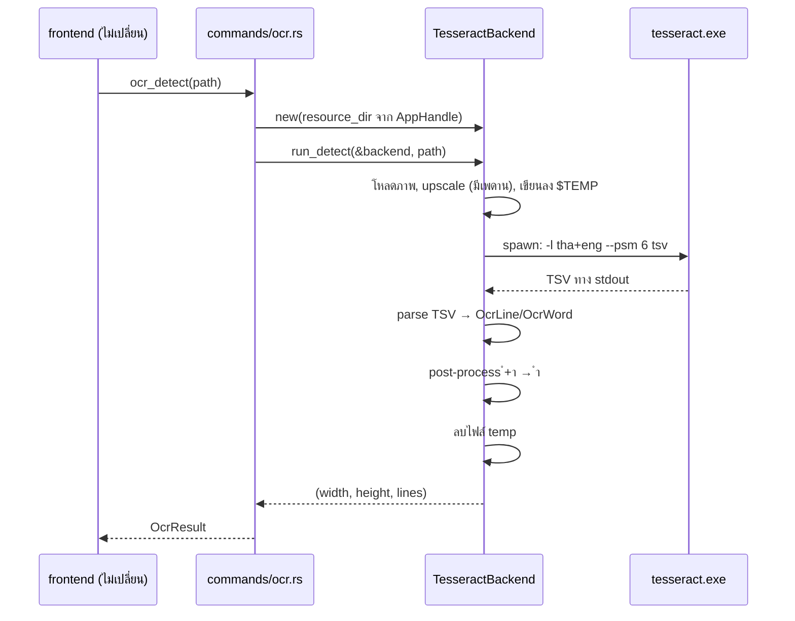

# Tesseract เป็น OCR backend บน Windows

**สถานะ:** อนุมัติแล้ว 15 ก.ย. 2026 — ข้อ ก และ ข ใน §9 ตัดสินแล้ว
**วันที่:** 14 ก.ย. 2026
**งานวิจัยที่รองรับ:** `docs/research/2026-08-19-oneocr-windows-thai.md` (ยังอยู่ใน PR #80)

---

## 1. ปัญหา

capz บน Windows อ่านภาษาไทยไม่ได้ และ**ไม่มีทางทำให้อ่านได้**ด้วย `Windows.Media.Ocr`
เพราะ Windows ไม่มีชุด OCR ภาษาไทยให้ติดตั้งเลย (ยืนยันกับตาราง FOD-to-LP ของ
Microsoft เอง: มีชุด OCR 35 ภาษา ไม่มี `th`) PR #79 แก้เอกสารกับ toast ที่บอก
ผู้ใช้ผิด ๆ ไปแล้ว — เอกสารนี้แก้ที่ต้นเหตุ

**ไม่เอา OneOCR** (engine ของ Snipping Tool) เพราะติดทั้งความเสี่ยง DMCA จากการ
แจกจ่ายโมเดลที่เข้ารหัสพร้อมคีย์, ข้อจำกัดขนาดภาพ 50–10000px ที่ชนกับ scrolling
capture โดยตรง, และการไม่มีเครื่อง Windows ทดสอบ รายละเอียดอยู่ในรายงานวิจัย ข้อ 4A–4D

**Tesseract ผ่านการวัดจริงแล้ว** — CER 6.1% บนสกรีนช็อตจริงของผู้ใช้ที่จงใจเลือกให้โหด
(terminal พื้นดำ, monospace, ผ่าน JPEG, ถ่ายจากมือถือ) เทียบกับสถานะปัจจุบันที่
อ่านไทยไม่ได้เลย — คนละโลกกัน รายละเอียดใน §8 ของรายงาน

---

## 2. ขอบเขต

**ทำ:** เปลี่ยน OCR backend บน Windows จาก `Windows.Media.Ocr` เป็น Tesseract

**ไม่ทำ:**
- macOS ใช้ Vision ต่อไปเหมือนเดิม ไม่แตะ `macos.rs` เลย (Vision อ่านไทยได้อยู่แล้ว
  และไม่ตกวรรณยุกต์ 34% แบบ Tesseract — เปลี่ยนไปใช้ Tesseract คือการ downgrade ผู้ใช้ Mac)
- ไม่แตะ `run_detect`, `pick_languages`, type `OcrBox`/`OcrLine`/`OcrResult`
- ไม่แตะ TypeScript ฝั่ง frontend เลย

---

## 3. การตัดสินใจหลัก 3 ข้อ

| ข้อ | เลือก | เหตุผล |
|---|---|---|
| ขอบเขต | เฉพาะ Windows | ดูข้างบน |
| การกระจาย | bundle เข้า `.msi` | ผู้ใช้ได้ของครบตั้งแต่ติดตั้ง ไม่มี error path เรื่องเน็ต ไม่มีการเรียกเครือข่ายใหม่ privacy policy ใน README จึงยังจริง |
| binding | spawn subprocess | ไม่มี native dependency ตอน build — ดู §6 |

**ขนาดที่ต้องจ่าย** (วัดจาก Linux เป็นตัวประมาณ ฝั่ง Windows จะใหญ่กว่าเล็กน้อย):

| ไฟล์ | ขนาด |
|---|---|
| `libtesseract` + `libleptonica` | ~6 MB |
| `tha.traineddata` | 1.0 MB |
| `eng.traineddata` | 4.1 MB |
| **รวม** | **~11 MB** |

> ⚠️ `createUpdaterArtifacts: true` แปลว่า Tauri updater โหลด bundle **ทั้งก้อน**
> ทุกครั้งที่อัปเดต ไม่ใช่ delta ผู้ใช้ทุกคนจึงจ่าย ~11 MB นี้**ทุกครั้งที่อัปเดต**
> รวมทั้งคนที่ไม่เคยแคปภาษาไทยเลย นี่คือต้นทุนที่ใหญ่ที่สุดของ design นี้

---

## 4. Tesseract แทน `Windows.Media.Ocr` ทั้งหมด ไม่ใช่อยู่คู่กัน

ถ้าเก็บสอง engine ไว้ ต้องตอบให้ได้ว่า *เมื่อไหร่ใช้ตัวไหน* — แต่เรารู้ไม่ได้ว่ารูปมี
ภาษาไทยไหมจนกว่าจะอ่านเสร็จ ทางที่เหลือคือรันทั้งคู่แล้ว merge (ช้า ซับซ้อน) หรือใช้
heuristic แบบ "ถ้า WinRT อ่านได้น้อยค่อยลอง Tesseract" — **ซึ่งเป็นกับดักตัวเดียวกับ
บั๊ก toast ที่เพิ่งแก้ใน #79** คือเดาจากสัญญาณอ้อม ๆ แล้วเดาผิด

**ผลพลอยได้:** `windows.rs` 173 บรรทัดถูกลบ — โค้ด WinRT ที่ header ของมันเองเขียน
เตือนไว้ว่ายังไม่เคยถูก compile หรือ verify บนเครื่องจริง

**ต้นทุน:** คุณภาพภาษาอังกฤษบน Windows จะเปลี่ยนไป **ยังไม่ได้วัด** ต้องวัดตอน implement
ก่อน merge

---

## 5. สถาปัตยกรรม

`OcrBackend` เป็นรอยต่อที่พอดีอยู่แล้ว — `run_detect` เป็น orchestration ล้วนและมี
เทสต์คุมด้วย `FakeBackend` อยู่แล้ว เพิ่ม backend ใหม่ไม่ต้องแตะ orchestration

### ไฟล์ที่แตะ

| ไฟล์ | การเปลี่ยนแปลง |
|---|---|
| `src-tauri/src/services/ocr/tesseract.rs` | **ใหม่** — `TesseractBackend` |
| `src-tauri/src/services/ocr/windows.rs` | **ลบ** |
| `src-tauri/src/services/ocr/mod.rs` | สลับ `pub mod` ตาม cfg |
| `src-tauri/src/commands/ocr.rs` | เปลี่ยน cfg branch + รับ `AppHandle` |
| `src-tauri/Cargo.toml` | ถอด feature `Media_Ocr` |
| `src-tauri/tauri.conf.json` | เพิ่ม `bundle.resources` |

### รายละเอียดที่ตัดสินใจแล้ว

**ใช้ TSV ไม่ใช่ plain text** — TSV ให้ `left/top/width/height` เป็นพิกเซล origin ซ้ายบน
**ตรงกับ `OcrBox` อยู่แล้ว** ไม่ต้อง flip แกนเหมือน Vision (`normalize_vision_box`
ยังใช้เฉพาะ macOS ต่อไป) และมีคอลัมน์ `line_num` ให้จัดกลุ่ม word เข้า line ได้ตรง ๆ

**`detect_blocking` ต้องรับ `AppHandle` เพิ่ม** เพื่อ resolve path ของ resource
ตอนนี้ยังไม่ได้รับ เป็นการแก้ signature เล็ก ๆ ที่เลี่ยงไม่ได้

**`thai_available` จะกลายเป็น `true` บน Windows** — toast ที่แก้ใน #79 จะหายไปเอง
โดยไม่ต้องแก้โค้ดอีก แต่ **`docs/OCR-THAI-WINDOWS.th.md` จะล้าสมัยทันทีที่ ship**
ต้องแก้เอกสารนั้นเป็นส่วนหนึ่งของงานนี้ ไม่ใช่ลืมไว้

**upscale ต้องมีเพดาน** — วัดแล้วว่า 3× ช่วยจริง (CER 10.0% → 7.1%) แต่สกรีนช็อต 4K
คูณ 3 = 11520×6480 กินแรมและช้ามาก ใช้วิธี upscale ให้ความสูงตัวอักษรพอใช้ แต่
**cap ที่ ~4000px ด้านยาว** ไม่ใช่ fix 3× ตายตัว — ตัวเลขเพดานที่พอดียังไม่ได้วัด
ต้องวัดตอน implement

**`ํ` + `า` → `ำ` เป็น post-process บังคับ** (U+0E4D+U+0E32 → U+0E33) Tesseract
คืนมาแบบแยกร่าง แก้ด้วย string replace บรรทัดเดียว ลด CER ได้เต็ม 1 จุด

**invert ไม่ต้องทำ** — วัดแล้วว่าไม่ช่วย (8.8% แย่กว่า 7.1% ของ upscale เปล่า)
Tesseract จัดการพื้นดำได้เองอยู่แล้ว

---

## 6. ทำไมถึงเลือก subprocess

ข้อจำกัดที่ยืนยันแล้วสองข้อเป็นตัวตัดสิน: **ไม่มีเครื่อง Windows ทดสอบ** และ
**CI ไม่ build Rust บน PR** แปลว่าโค้ด Windows ถูก compile ครั้งแรกตอน release พอดี
ซึ่งเป็นสิ่งที่เกิดกับ `windows.rs` มาแล้ว

- `leptess` ต้องมี libtesseract ตอน build บน Windows (vcpkg) — build system risk
  ที่เราทดสอบเองไม่ได้เลย และจะโผล่ตอน release
- subprocess ใช้ `std::process::Command` ล้วน **คอมไพล์ผ่านทุกเครื่อง** และ
  **Linux เครื่อง dev มี `tesseract` ติดตั้งแล้ว จึงเขียนเทสต์ที่รัน engine จริง
  แล้วตรวจผลได้เลยบนเครื่องนี้**

ถ้า process overhead (~100–300 ms ต่อครั้ง) กลายเป็นปัญหาจริงในการใช้งาน ค่อยย้ายไป
`leptess` ทีหลังโดยไม่กระทบ UI เพราะ `OcrBackend` ซ่อนวิธีเรียกไว้ข้างในอยู่แล้ว

---

## 7. เทสต์

**ชั้นที่ 1 — parser TSV (ฟังก์ชันบริสุทธิ์ ไม่ต้องมี tesseract)**
รับ string คืน `Vec<OcrLine>` เทสต์ได้ทุกแพลตฟอร์ม: คอลัมน์เพี้ยน, `conf = -1`,
บรรทัดว่าง, ข้อความที่มี tab อยู่ข้างใน, การจัดกลุ่ม word เข้า line ตาม `line_num`

**ชั้นที่ 2 — integration กับ engine จริง**
รัน tesseract บนภาพ fixture แล้ว assert ว่า CER ไม่เกินเพดานที่ตั้งไว้
ข้ามเทสต์เองถ้าไม่เจอไบนารี **รันได้จริงบน Linux เครื่อง dev**

**ชั้นที่ 3 — วัดคุณภาพภาษาอังกฤษเทียบ `Windows.Media.Ocr` ก่อน merge**
เป็น regression risk ที่ยังไม่ได้ตอบ (§4)

---

## 8. Error handling

**กฎ: ถ้า error นั้นผู้ใช้ทำอะไรไม่ได้ ก็อย่าสั่งให้เขาทำ** — บทเรียนตรงจากบั๊กที่แก้ใน #79

| กรณี | ผู้ใช้เห็น |
|---|---|
| หาไบนารีไม่เจอ / spawn ไม่ได้ | การติดตั้งพัง ไม่ใช่ความผิดผู้ใช้ → บอกว่าพังและให้แจ้ง issue **ห้าม**แนะนำให้ไปตั้งค่าอะไร |
| exit code ไม่เป็น 0 | log stderr ไว้ debug, ผู้ใช้เห็นข้อความ fail กลาง ๆ |
| TSV ว่าง / ไม่มีบรรทัด | ไม่ใช่ error — คืนผลว่าง ให้ UI ขึ้น "No text found" ตามเดิม |

---

## 9. คำถามที่ค้างตอนออกแบบ

### ก) `tesseract.exe` สำหรับ Windows เอามาจากไหน

Tesseract เป็น Apache-2.0 จึงแจกจ่ายได้ถูกกฎหมาย ต่างจาก OneOCR ชัดเจน แต่ยังไม่ได้
ตัดสินใจว่าจะเอา binary เข้ามายังไง:

| ทาง | ได้ | เสีย |
|---|---|---|
| vendor เข้ารีโป | ตรวจสอบย้อนหลังได้ build ไม่พึ่งใคร | ~11 MB อยู่ใน git ตลอดไป |
| CI ดาวน์โหลด + verify checksum | รีโปสะอาด | ผูกกับ UB-Mannheim, build พังถ้าเขาลบไฟล์ |

**✅ ตัดสินแล้ว: CI ดาวน์โหลด + verify SHA-256** ปักเวอร์ชันและ checksum ไว้ใน workflow ถ้าไฟล์ต้นทางถูกแก้ build จะพังทันที ไม่หลุดไปถึงผู้ใช้

### ข) CI ยังไม่ build Rust บน PR

งานนี้แตะ Rust + packaging เต็ม ๆ ถ้าไม่แก้ตรงนี้ โค้ดจะถูก compile ครั้งแรกตอน
release เหมือนเดิม **เสนอให้เพิ่ม job `cargo check` บน windows runner เข้า PR workflow
เป็นส่วนหนึ่งของงานนี้** — เป็นความเสี่ยงที่มีอยู่ก่อนแล้ว แต่งานนี้ทำให้มันเจ็บกว่าเดิมมาก

**✅ ตัดสินแล้ว: เพิ่มในงานนี้ เป็นงานแรกของ plan** ก่อนแตะโค้ด OCR

### ค) `tessdata_best` ดีกว่าไหม

Ubuntu ให้ `tha.traineddata` เวอร์ชัน 4.1.0 มา ส่วน upstream มี `tessdata_best`
ที่น่าจะแม่นกว่า **ยังไม่ได้วัด** ถ้าดีกว่าจริงและขนาดไม่ต่างมาก ควรใช้ตัวนั้น

**⏳ ยังเปิดอยู่ — วัดเองได้ ไม่ต้องรอผู้ใช้** อยู่ใน plan

---

## 10. สิ่งที่ผู้ใช้จะยังไม่ได้

วรรณยุกต์บนสระบนหายไป ~34% (`ที่`→`ที`, `เมื่อ`→`เมือ`, `ชื่อ`→`ซือ`) เพราะไม้เอก/
ไม้โทซ้อนเหนือสระอิ/อือ สูงเกินกรอบบรรทัดที่โมเดลคาด

**แปลว่า:** ใช้ไล่อ่านและค้นข้อความในสกรีนช็อตได้จริง แต่คนที่หวังจะก๊อปข้อความไทยไป
ใช้ต่อแบบไม่ต้องแก้จะผิดหวัง **ต้องสื่อสารตรงนี้ให้ชัดใน release note และในเอกสาร**
ไม่ใช่ปล่อยให้ผู้ใช้ไปเจอเอง
